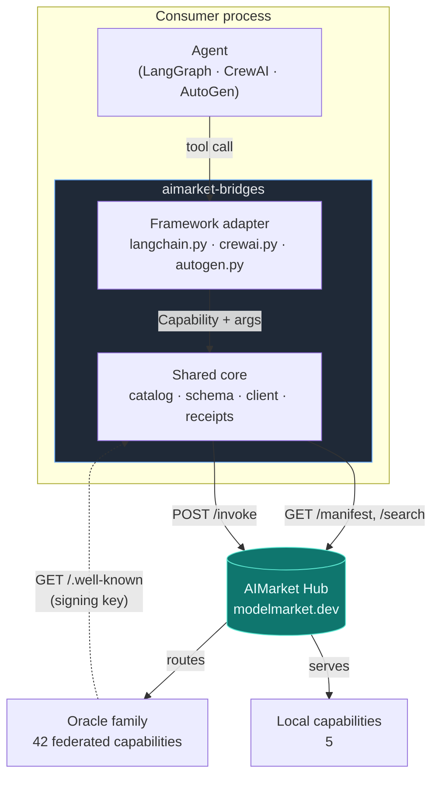
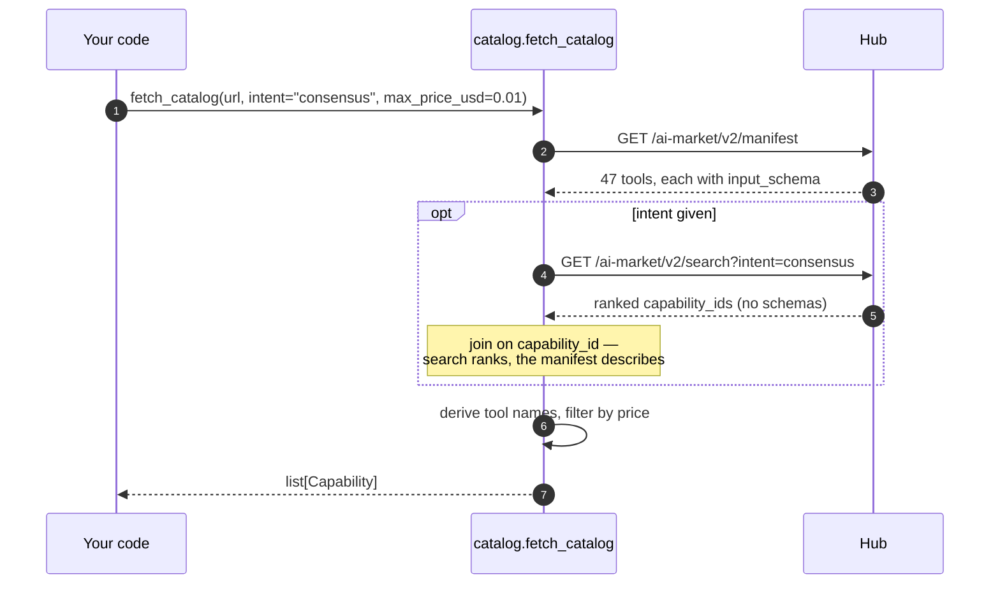
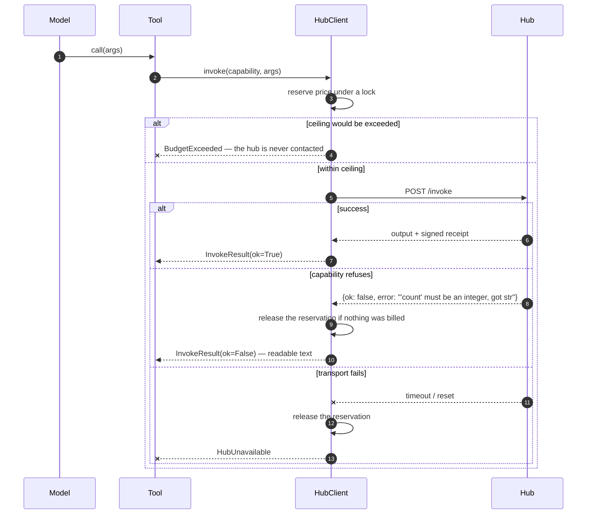
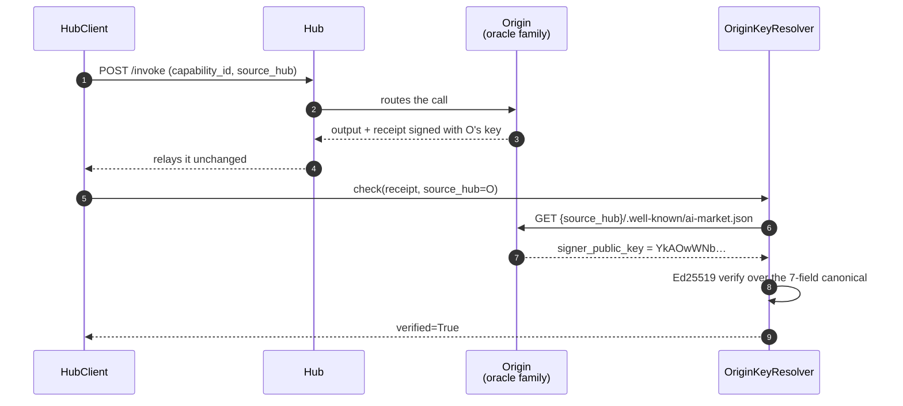
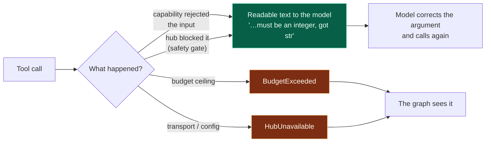
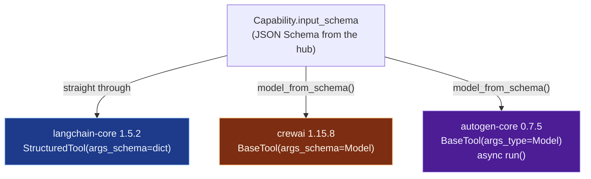
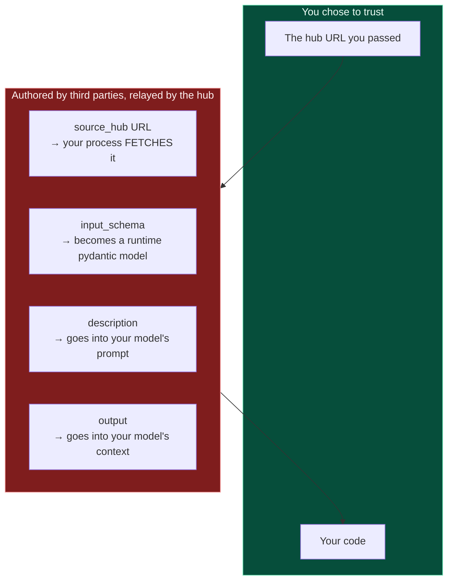

# aimarket-bridges — architecture and design notes

**What it is.** A thin layer that makes the capabilities on an AIMarket hub appear as native
tools inside LangChain/LangGraph, CrewAI and AutoGen.

**Why it exists.** Before it, a developer wanting to buy a verifiable random draw from their
LangGraph agent had to read the protocol spec, write an HTTP client, and handle payment
channels, signed receipts and verification — a day of work before the first useful call. Now:

```python
from aimarket_bridges.langchain import aimarket_tools

tools = aimarket_tools("https://modelmarket.dev", intent="verifiable randomness")
```

The marketplace has 47 capabilities and, at the time of writing, one paying external
consumer. The bottleneck is demand, not supply, and this is the only piece of work that
addresses it: it turns "learn a protocol" into "install a package".

---

## 1. Shape of the thing



The dotted arrow is the part most easily got wrong, and section 4 is about it.

Each framework declares a tool differently; nothing else about a tool call differs. So the
money, the refusals and the receipt live in the core, once, and each adapter is a thin
translation of one interface into another.

| Layer | File | Responsibility |
|---|---|---|
| Catalogue | `catalog.py` | manifest → `Capability` records, framework-safe names |
| Schema | `schema.py` | JSON Schema → pydantic model, for frameworks that demand one |
| Invoke | `client.py` | one call: budget, refusal, receipt |
| Trust | `receipts.py` | resolve the signing key of a capability's **origin** |
| Adapters | `langchain.py`, `crewai.py`, `autogen.py` | one framework each |

---

## 2. Where the catalogue comes from



Two measured facts shaped this.

**`/search` does not return `input_schema`.** Only the manifest does. A tool without an
argument schema is a tool no model can call correctly, so the manifest is the only viable
source; search contributes ranking, joined back on `capability_id`. The search parameter is
named `intent`, not `q` — a hub given anything else answers with an unfiltered top-N, which
reads like broken search when it is a different parameter name.

**Not one of the 47 manifest names is usable as a tool name.** They contain dots and `@`, and
several contain spaces (`prod-skopos.Security posture@v1`), while tool names must generally
match `^[A-Za-z0-9_-]{1,64}$`. Names are therefore derived from `capability_id`
(`sortes.draw@v1` → `sortes_draw_v1`) and de-duplicated deterministically: a saved agent
graph stops matching its tools if names shuffle between runs.

**`fetch_catalog` raises when the hub is unreachable.** It does not return an empty list. An
agent that boots believing it has no capabilities is a far worse failure than one that
refuses to boot — and the reference SDK's `discover()` swallows every exception and answers
`[]`, which is exactly the failure being avoided here.

---

## 3. Money



**The reservation happens before the call**, under a lock. Reserving afterwards would let two
concurrent calls both pass the same check — and LangGraph and CrewAI both run tool calls from
worker threads, which is exactly when a spend counter matters. A 40-thread test proves a
$0.10 ceiling permits exactly ten $0.01 calls.

**`budget_usd=0` means spend nothing. `None` means no ceiling.** This is worth stating because
it was wrong: `_reserve` tested `if self.budget_usd and …`, so a falsy budget skipped the
check entirely. An operator writing `0` to mean "spend nothing" got unlimited spend, while
`remaining_usd` reported `$0.00` for the whole run. All three adapters had independently grown
a guard against it, which is the clearest possible sign the defect was one level down.

**`max_price_usd` and `free_only` filter at build time**, which is the only honest place for a
limit: once a tool is in the agent's registry the agent decides when to call it, so a
capability the operator cannot afford must never be handed over.

A refused call releases its reservation **only if nothing was billed**. When a refusal comes
back with a receipt, the call *was* metered, and pretending otherwise would let a loop of
refusals spend invisibly.

### What is actually charged today

Nothing, for 42 of the 47 capabilities. `price_per_call_usd` in the manifest is a **list
price**, and the hub only collects it for a federated capability when the operator has
declared `AIMARKET_SELLS_FOR` for that peer — which is unset on `modelmarket.dev`. So the
`$0.006` a tool description quotes for `aestus.seal@v1` is what the call *would* cost, not
what left anyone's balance. `remaining_usd` moving in a bridge run is this client's own
bookkeeping against `budget_usd`, not a debit.

Two things follow for a bridge author:

- **Do not treat a successful call as proof of a working payment path.** It is not; it is
  proof of a working free tier. The paid path is exercised by the escrow tests, not by this.
- **A free call can still be refused, with `402`.** The two capabilities that sell
  computation cap what an unpaid caller may ask for — `chronos.eval@v1` at
  `difficulty=100000`, `aestus.seal@v1` at `T=1000000` — and answer `402 payment_required`
  above it, carrying the ceiling in `free_tier`. `InvokeResult` surfaces this as
  `payment_required` and, specifically, **as a refusal about the input** rather than as "the
  operator has to fund a channel": lowering the field is the fix, and the model can do that
  itself. Collapsing the two would tell a model to give up on a call it could have made. The
  ceilings are published in the manifest, so `max_price_usd`/`free_only` filtering can read
  them at build time. Full detail: [free-and-paid-tiers](https://github.com/alexar76/aicom/blob/main/docs/free-and-paid-tiers.md).

If `AIMARKET_SELLS_FOR` is ever set, every one of those 42 starts answering `402` to an
invoke with no `X-Payment-Channel`, in the same minute, with no grace period. A bridge that
handles `payment_required` today keeps working; one that treats it as fatal stops.

---

## 4. Receipts, and what a signature actually proves



A hub is a **broker**. When it routes an invoke to a federated provider, what comes back
carries the *provider's* signature, not the hub's — that is the design, and it is what lets a
buyer check the work without trusting the middleman.

So the key depends on where the capability lives. Measured on `modelmarket.dev`:

| Origin | `signer_public_key` |
|---|---|
| hub `modelmarket.dev` | `sVjlCo52rBsmBH69iSXQ3oIB3LbWo4BgXT3iBhabDeM=` |
| `oracles.modelmarket.dev/family` | `YkAOwWNbRFti2cqEzD6zfuI4OTLsGUoObpCmlwZqaTQ=` |

42 of 47 capabilities are federated, so verifying everything against the hub's key reports
`invalid-signature` for **89% of the catalogue** — on receipts that are perfectly valid. The
reference SDK did exactly that up to and including 2.1.2; `aimarket-agent` 2.2.0 fixes it, and
this package fixes it independently because its floor is `>=2.1` and 2.1.x is what is
installed on any machine that has not upgraded.

**What a verified receipt does and does not prove.** It proves that *the party publishing a
key at that URL* signed this exact 7-field record: nonce, product, capability, price,
timestamp, success, latency. It does **not** prove the party is honest, that the computation
was correct, or that the price matches what any ledger charged. A federated provider can
publish any key and sign with the matching secret. The signature establishes attribution and
non-repudiation, not virtue — and for the mathematical claims, several oracles ship a separate
`verify` capability precisely so the *answer* can be checked independently of the receipt.

**Three states, not two.** `ReceiptCheck.verified` is `True`, `False`, or `None` for "not
checked". Collapsing `None` into `False` is how the SDK's false alarm stayed invisible: "we
could not look" and "the signature is wrong" call for opposite reactions.

**The receipt is kept out of the tool's text result.** Pushing it into the content would spend
model context on a blob no model reads. It travels through each framework's own metadata
channel and through `HubClient.last_receipt`.

---

## 5. Refusals are results; failures are exceptions



A model told `'count' must be an integer, got str` fixes the argument on the next turn.
Raising instead aborts the surrounding graph or crew over something the model could have
repaired itself. Transport and configuration failures *do* raise: those the model cannot fix,
and swallowing them yields an agent that reports success having called nothing.

---

## 6. The three frameworks disagree about tools



Every statement below was measured by introspection against the installed version, not taken
from documentation — all three had moved past what the docs implied.

**langchain-core 1.5.2** accepts a raw JSON Schema dict as `args_schema`. Nothing to convert.

**crewai 1.15.8** accepts a dict too — and converts it with its own
`create_model_from_schema`, which **refuses union types**: `Unsupported JSON schema type:
['string', 'integer']`. Ten of the 47 live capabilities die there (percola, fermat, ablation,
landauer and fourier, each producer and its verifier). `schema.py` builds all ten. Even on the
37 that survive, crewai's converter knows nothing of the alias inversion below.

**autogen-core 0.7.5** derives a schema from a function's *type annotations*, so `FunctionTool`
cannot express a capability whose shape arrives at runtime; `BaseTool` with an explicit
`args_type` is the right door, and its `run()` is async.

### Keyword-named properties

The trap that would have cost the most:

| Capability | Property | Problem |
|---|---|---|
| `fourier.verify@v1` | `lambda` — **required** | a Python keyword |
| `fermat.route@v1` | `from`, nested in an edge | a Python keyword |
| `fermat.verify@v1` | `from`, nested in an edge | a Python keyword |

A pydantic field cannot be called `lambda`, so it becomes `lambda_`. Stopping there produces
a tool that advertises an argument no capability accepts and sends one no capability reads —
a refusal on a call that was **already billed**. `schema.py` attaches a pydantic `alias`, so
the rewrite round-trips: `model_json_schema()` shows `lambda` and
`model_dump(by_alias=True)` emits `lambda`.

Proven end to end over the live network, not in a stub: `fourier.spectrum@v1` →
`fourier.verify@v1`, keys on the wire `['edges', 'lambda', 'laplacian', 'tol', 'vector']`,
verifier answering `valid: True`, residual 2.3e-16, both receipts verified against their
origin's key.

### langchain reserves two argument names

`BaseTool.run` merges `run_manager` and its `RunnableConfig` **over** the model's arguments,
keyed on what it finds on `_run`'s signature — and `StructuredTool._run` declares both. A
capability property named `config` or `run_manager` therefore never reached the hub. With an
*optional* colliding property the paid call goes out silently missing an argument the model
supplied: billed, wrong answer, nothing raised, because a dict `args_schema` validates
nothing. With a *required* one the capability is uncallable. The adapter subclasses
`StructuredTool` with a `_run` that declares neither name.

### crewai turns one exception into six paid calls

`tool_usage.py` wraps the invoke in `try: tool.invoke(...) except Exception:
tool.invoke(...)`, and the ReAct loop retries three times. A hub that times out *after* the
provider already ran is indistinguishable from one that never answered, so a single tool call
could bill the hub six times while the bridge's own counter showed nothing spent. The adapter
catches `HubUnavailable` inside `_run`.

### Caching

A cache keyed on arguments would sell the same `sortes.draw@v1` draw twice. Per framework, as
measured on the installed versions: crewai's `cache_function` is disabled for every tool;
langgraph 1.2.10 *does* have a cache layer (`StateGraph.compile(cache=…)` plus a per-node
`cache_policy`) but `create_react_agent` reaches neither; autogen's tool results are not
cached by the agent loop.

---

## 7. Trust boundaries



42 of the 47 capabilities are federated: a third party writes their metadata and the hub
relays it. Four fields cross that boundary into your process, and it is worth naming them
plainly rather than discovering them later.

- **`source_hub`** is a URL your process fetches to resolve a signing key. Federation with
  strangers is the product, so fetching peer URLs is inherent, but the request is constrained:
  the fragment and query are dropped so the path cannot be steered (a `#` used to suppress the
  appended suffix entirely and give exact path control), only `http`/`https` are fetched, and
  redirects are not followed. It is deliberately **not** an address filter — refusing loopback
  and private ranges would refuse this project's own documented deployments and silently
  downgrade every receipt in a self-hosted stack from verified to "unchecked". `source_hub` is
  also hub-authored: the crawler overwrites whatever a peer claims with the URL it actually
  crawled, and screens that against its own SSRF guard before indexing.
- **`input_schema`** becomes a pydantic model at tool-build time. `schema.py` reports anything
  it cannot model (`unsupported_keywords`) rather than dropping it silently, because a tool
  advertising an interface it does not honour fails far from the cause.
- **`description`** reaches your model's prompt. Nothing sanitises it, and nothing can, in
  general: it is prose whose purpose is to persuade a model to call the tool. Treat a hub's
  catalogue with the same care as any other prompt content you did not write.
- **`output`** reaches your model's context whole.

The bridge's own guards against a hostile *peer* are: price ceilings at build time, a spend
ceiling enforced before each call, a refusal path that cannot abort your graph, and
verification bound to the origin that signed. What it deliberately does **not** do is decide
which peers deserve trust — that is the hub operator's job, and the hub exposes trust scores
and stake for it.

---

## 8. The shared signature

All three adapters take the same arguments, so moving a graph from one framework to another
changes the import and nothing else:

```python
aimarket_tools(
    base_url,               # "https://modelmarket.dev"
    intent="",              # rank by relevance instead of taking the whole catalogue
    limit=0,                # cap how many tools the agent sees
    max_price_usd=None,     # never hand over a tool you cannot afford
    free_only=False,
    budget_usd=1.0,         # 0 = spend nothing · None = no ceiling
)
```

`intent`, `limit`, `max_price_usd` and `free_only` filter at build time, which is the only
honest place: once a tool is in the agent's registry the agent decides when to call it.
`budget_usd` is a ceiling across every tool in the returned list — they share one `HubClient` —
enforced before each call and safe across threads.

Install instructions and a worked example per framework are in §9.

---

## 9. How to call it

### Install, and why the order matters

```bash
pip install "aimarket-bridges[langgraph]"
```

```bash
pip install "aimarket-bridges[crewai]"
```

```bash
pip install "aimarket-bridges[autogen]"
```

Install only the extra you use. CrewAI and AutoGen do not agree on a pydantic version and
cannot share an environment — this package keeps no framework in its own dependencies for
that reason.

The bridge requires `aimarket-agent>=2.2`, because 2.1.x verifies every receipt against the
hub's key and knows nothing of the v2 canonical, so it answers `invalid-signature` for all 42
federated capabilities and for every rejection receipt. Until 2.2.0 is on PyPI, install both
from a checkout, SDK first:

```bash
pip install ./aimarket-agent ./aimarket-bridges
```

### LangChain / LangGraph

```python
from aimarket_bridges.langchain import aimarket_tools

tools = aimarket_tools(
    "https://modelmarket.dev",
    intent="verifiable randomness",   # rank by relevance; omit for the whole catalogue
    budget_usd=0.50,                  # shared ceiling across every call these tools make
    max_price_usd=0.01,               # never hand over a tool dearer than this
)
```

Hand them to an agent the ordinary way:

```python
from langgraph.prebuilt import create_react_agent

agent = create_react_agent(your_model, tools)
result = agent.invoke({"messages": [("user", "draw a verifiable random number")]})
```

That emits a deprecation warning on LangGraph 1.x — it moved to
`from langchain.agents import create_agent`, which needs the umbrella `langchain` package that
`langgraph` alone does not pull in. It is still the shorter path if you have only
`langchain-core` and `langgraph` installed, and it is what the live run in §11 used; switch to
`create_agent` when you add `langchain` for other reasons. Either accepts these tools
unchanged — nothing in the bridge depends on which one builds the graph.

Or call one directly, which is what the model does:

```python
tool = {t.name: t for t in tools}["sortes_draw_v1"]
output = tool.invoke({"alpha": "my-seed"})
```

The receipt travels as the tool's **artifact**, so it never costs the model context:

```python
message = tool.invoke(
    {"args": {"alpha": "my-seed"}, "id": "call_1", "name": tool.name, "type": "tool_call"}
)
message.artifact["receipt_verified"]   # True
message.artifact["price_usd"]          # 0.006
message.artifact["receipt"]["nonce"]
```

`tool.metadata` carries `capability_id`, `price_usd`, `source_hub` and `product_id`, so a
graph can route or filter on them without parsing the description.

### CrewAI

```python
from aimarket_bridges.crewai import aimarket_tools
from crewai import Agent

tools = aimarket_tools("https://modelmarket.dev", budget_usd=0.50)

researcher = Agent(
    role="Researcher",
    goal="Draw randomness nobody can grind",
    backstory="Buys verifiable capabilities rather than trusting a coin flip.",
    tools=tools,
    llm=your_llm,
)
```

Calling one directly, and reading the provenance afterwards:

```python
tool = next(t for t in tools if t.capability.capability_id == "sortes.draw@v1")
output = tool.run(alpha="my-seed")

tool.last_result.receipt_verified   # True
tool.last_result.price_usd          # 0.006
tool.client.spent_usd               # running total across every tool in this list
```

Caching is disabled on every tool (`cache_function=never_cache`) and that is deliberate:
`sortes.draw@v1` and `platon.random@v1` return fresh randomness, so a cache keyed on
arguments would sell the same draw twice.

### AutoGen

```python
from aimarket_bridges.autogen import aimarket_tools
from autogen_agentchat.agents import AssistantAgent

tools = aimarket_tools("https://modelmarket.dev", budget_usd=0.50)
assistant = AssistantAgent("buyer", model_client=your_client, tools=tools)
```

Calling one directly — use `run_json`, which is the entry point AutoGen itself uses:

```python
import asyncio
from autogen_core import CancellationToken

tool = next(t for t in tools if t.capability.capability_id == "sortes.draw@v1")
result = asyncio.run(tool.run_json({"alpha": "my-seed"}, CancellationToken()))

result.output              # the capability's own answer
result.receipt_verified    # True
tool.return_value_as_string(result)   # what the model reads
```

`run(args, token)` takes an **instance** of the args model. `tool.args_type()` returns the
class, not an instance — it is a method in autogen-core — so build it with
`tool.args_type()(**kwargs)` or use `run_json`, which does that for you.

### Without a framework

```python
from aimarket_bridges import fetch_catalog, HubClient

caps = fetch_catalog("https://modelmarket.dev", intent="consensus")
with HubClient("https://modelmarket.dev", budget_usd=0.50) as hub:
    result = hub.invoke(caps[0], {"values": [1.0, 2.0, 3.0, 100.0]})
    print(result.output, result.receipt_verified)
```

### What a refusal looks like

Nothing raises when a capability rejects its input. The tool returns a sentence the model
acts on:

```
sortes.draw@v1 refused this input: 'num_bytes' must be an integer, got str
```

`BudgetExceeded` and `HubUnavailable` **do** raise — a spend ceiling and an unreachable hub
are not things a model can fix by rewriting an argument.

---

## 10. Tests

530 tests in this package, and 734 across everything the bridge touches. The core suite is
parametrized over the 47 real capabilities captured in `tests/live_manifest.json` — the actual
manifest of `modelmarket.dev` — rather than hand-written fixtures, because every interesting
problem here came from what the real catalogue contains: names with spaces, union types,
`oneOf` nested inside `items`, keyword property names, two properties that sanitise to the
same identifier, and 42 of 47 entries signed by somebody other than the hub. No unit test
touches the network.

| Suite | Tests |
|---|---|
| core (`schema`, `catalog`, `client`, `receipts`) | 234 |
| langchain / langgraph | 172 |
| crewai | 58 |
| autogen | 66 |

Four more suites guard the contracts this package shares with the rest of the ecosystem, and
all of them now run in CI — they were executed only by hand until 2026-07-30:

| Suite | Tests | What it would catch |
|---|---|---|
| `aimarket-agent` | 43 | origin-key resolution, the v1 and v2 canonicals |
| protocol vectors ↔ 4 implementations | 23 | a canonical string drifting in any of them |
| hub escrow bridge | 119 | spend ceilings, the replay guard, key handling |
| oracle distribution names | 19 | a dependency name a stranger owns on PyPI |

---

## 11. Live verification

Everything below was run against the production hub `https://modelmarket.dev` on 2026-07-29
and 2026-07-30. It is recorded because a passing unit suite proves the adapters agree with a
stub, and what a buyer needs to know is whether they agree with the network.

The capability prices quoted are list prices, and on the federated catalogue nothing collected
them — see "What \"$0.006 billed\" actually means" below, which is the part most easily
misread.

### What the live catalogue actually is

```
47 capabilities   5 local · 42 federated, all from https://oracles.modelmarket.dev/family
hub signing key        sVjlCo52rBsmBH69iSXQ3oIB3LbWo4BgXT3iBhabDeM=
origin signing key     YkAOwWNbRFti2cqEzD6zfuI4OTLsGUoObpCmlwZqaTQ=
```

Two distinct keys, which is the whole reason §4 exists. Note also that the 42 "federated"
capabilities all come from the operator's own satellite: today there is no third-party-authored
`source_hub`, `input_schema` or `description` in production. The trust boundary in §7 is real
but currently unexercised.

### The three adapters, each making a real paid call

All three built 47 tools from the live manifest and invoked `platon.state@v1` at $0.001.

| Adapter | Entry point used | Result | Receipt |
|---|---|---|---|
| LangChain | `tool.invoke({})` | `dict` output | `artifact.receipt_verified = True` |
| CrewAI | `tool.run()` | `dict` output | `last_result.receipt_verified = True` |
| AutoGen | `tool.run_json({}, token)` | `CapabilityResult` | `receipt_verified = True` |

The description each model would see, identical across the three:

```
[$0.0010 per call · via https://oracles.modelmarket.dev/family] Snapshot of the 32D universe
— telemetry, oscillators, projection…
```

LangChain's metadata, for a graph that wants to route rather than read prose:

```python
{'capability_id': 'platon.state@v1', 'price_usd': 0.001,
 'source_hub': 'https://oracles.modelmarket.dev/family', 'product_id': 'prod-platon'}
```

CrewAI reported `cache_function = never_cache` and a running total of `$0.0010` against a
`$0.02` ceiling. AutoGen used its dedicated 8-thread pool, built on first use.

### A producer → verifier round trip, which is the harder proof

`fourier.spectrum@v1` computes a graph's Fiedler pair; `fourier.verify@v1` checks it. The
second has a **required property named `lambda`** — a Python keyword — so a pydantic field
cannot carry that name and the alias has to invert on the way out. If it does not, every call
to that capability is a billed, guaranteed refusal.

Input for the verifier was built through the generated args model, the way an agent would:

```
keys on the wire:  ['edges', 'lambda', 'laplacian', 'tol', 'vector']
```

`lambda`, not `lambda_`. The verifier's answer:

```json
{"valid": true, "residual": 2.2887833992611197e-16,
 "orthogonality": 1.719950113979704e-16, "is_eigenpair": true}
```

Both receipts verified against the origin's key. $0.0060 for the pair.

### The SDK, before and after

The same federated invoke through `aimarket-agent` directly:

```
2.1.2   receipt_verified = False   invalid-signature
2.2.0   receipt_verified = True    ok
```

Nothing about the call changed. 2.1.2 verified against the hub's key, and the signer was the
oracle — so it reported a forgery on 42 of 47 capabilities. The same run also resolved both
origins to their own distinct keys, which is the check that could not have passed before.

### Two things the live runs taught that no stub would have

**Local capabilities require payment; federated ones went through on the free trial.** Both
`skopos.fleet.status@v1` and `security-rules.sec-feed@v1` answered:

```json
{"success": false, "error": "payment_required",
 "detail": "X-Payment-Channel required for paid capability invoke", "needed": 0.01}
```

while `platon.state@v1` — federated, also paid — completed. So the trial tier covers the 42
federated capabilities and not the 5 local ones. Whether that asymmetry is intended is a
question for the hub operator; it is recorded here because it changes what a new consumer
experiences on their first call.

**`tool.args_type()` in autogen-core is a method returning the class, not a constructor.**
Passing its result to `run()` produced `TypeError: BaseModel.model_dump() missing 1 required
positional argument: 'self'` from deep inside the adapter, pointing at the wrong place
entirely. Found by driving the adapter by hand, which is exactly who hits it; the adapter now
answers with a message naming `run_json`.

### A real model driving each bridge

The runs above call the tools directly, the way a framework does. What they do not prove is
that a *model* can pick the right tool out of a catalogue and fill its arguments — so that was
run too, with `minimax/minimax-m3` over OpenRouter, temperature 0, against the same production
hub. Each framework was handed the five tools that `intent="verifiable randomness"` ranks
highest and asked for a draw with a specific seed.

**LangGraph** (`create_react_agent`, 5 tools):

```
tools offered   sortes_draw_v1 · platon_random_v1 · platon_beacon_v1 · platon_commit_v1 · platon_reveal_v1
AIMessage       CALL sortes_draw_v1({'alpha': 'aicom-live-test'})
ToolMessage     {"suite": "ECVRF-EDWARDS25519-SHA512-TAI", "public_key": "3c813559787c5cda…
                receipt verified: True | $0.006
AIMessage       8da29499522bdb49b8802fab3e2ccd8e0b596f5cf101cea51140ef965dba5640…
```

**CrewAI** (`Agent` + `Task` + `Crew.kickoff()`, 4 tools): the agent selected
`sortes_draw_v1`, the receipt verified (`ok`), $0.0060 of a $0.05 ceiling spent, and the crew
returned the beta hex.

**AutoGen** (`AssistantAgent` with `reflect_on_tool_use=True`, 4 tools):

```
ToolCallRequestEvent    sortes_draw_v1({"alpha":"aicom-autogen-test"})
ToolCallExecutionEvent  {"suite": "ECVRF-EDWARDS25519-SHA512-TAI", …
TextMessage             **Beta value:** 20d23772153ba0f1b2fefc1e24f41fb53d2a3b85…
receipt                 verified=True (ok) $0.006
```

Three different frameworks, three different agent loops, one model, and in every case: the
right tool chosen out of several, the argument named correctly (`alpha`), a real ECVRF draw
from the oracle, and a receipt that verified against the **origin's** key rather than the
hub's.

### What "$0.006 billed" actually means

Nothing was charged to anybody, and the figure needs saying carefully because the bridge
prints it as if it were a charge.

`$0.006` is the capability's **list price** from the catalogue. The bridge subtracts it from
its own `budget_usd` ceiling and reports it as `price_usd`, and the oracle states it inside the
signed receipt. None of that moves money. Verified on the hub after the runs: the escrow
authorisation store still held exactly the same three `pending` rows and 240000 units as
before, and the channel ledger the same 4 channels and 2 debited receipts — no channel was
opened, no debit authorisation stored, no ledger entry made, no USDC anywhere.

The reason is in the hub's invoke path. Its payment gate — 402 `payment_required` without an
`X-Payment-Channel` — sits **inside** the `source_hub == "local"` branch. On the federated
branch the hub only *passes through* a 402 that the peer itself returns; it does not charge on
the peer's behalf. The oracle family does not return one. So the five local capabilities are
gated (measured: `skopos.fleet.status@v1` and `security-rules.sec-feed@v1` both answer
`payment_required`) and the 42 federated ones are, today, free to call while advertising a
price.

For a consumer that is simply the current state of the network. For an operator it is worth
knowing that `budget_usd` bounds what the catalogue *says* the calls cost, not what leaves a
wallet — the two coincide only once the provider enforces payment.

Worth noting what these runs do *not* show, either. One model, one temperature, one prompt
shape, and a capability whose argument is a single string. A capability with a nested `oneOf`
argument — a `fermat.route@v1` edge, say — asks considerably more of a model, and nothing here
measures how often it gets that right. What is settled is that the bridge is not the obstacle.

### Framework versions the suites actually resolved

```
langchain-core 1.5.2 · langgraph 1.2.10 · crewai 1.15.9 · autogen-core 0.7.5
pydantic 2.12.5 (with crewai) · 2.13.4 (with autogen)
for the live model runs: langchain-openai 1.4.1 · autogen-ext 0.7.5 · minimax/minimax-m3
```

The adapters were written against crewai **1.15.8** and pass on 1.15.9, which is the useful
fact — and the two pydantic versions are why the CI job builds two virtualenvs rather than one.

Apache-2.0.
