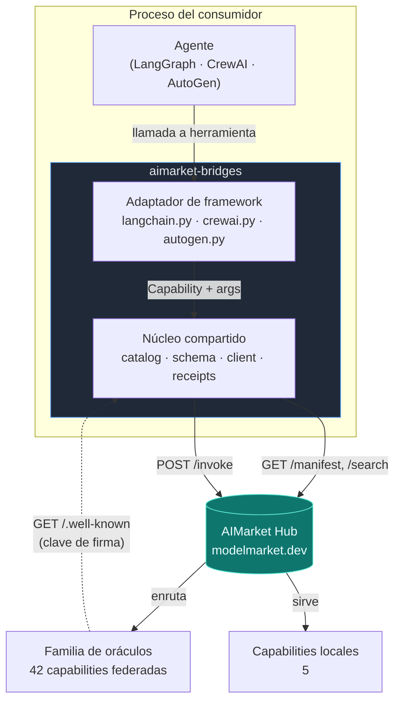
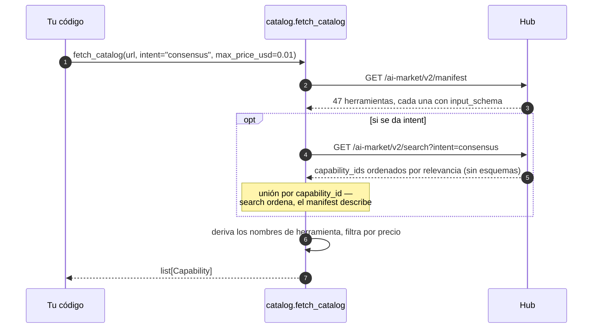
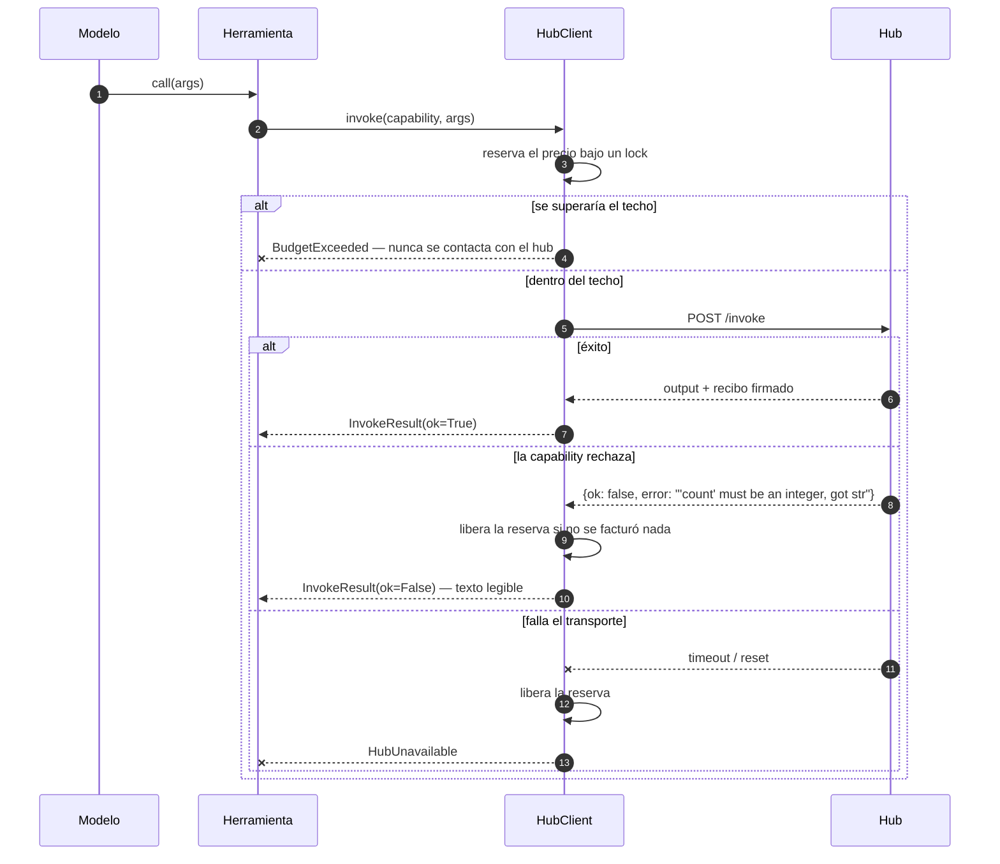
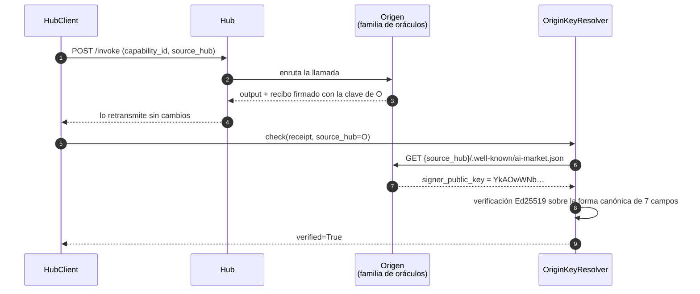
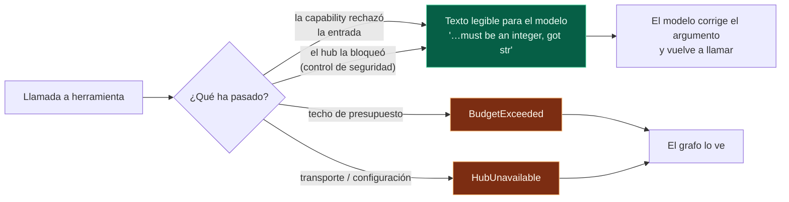
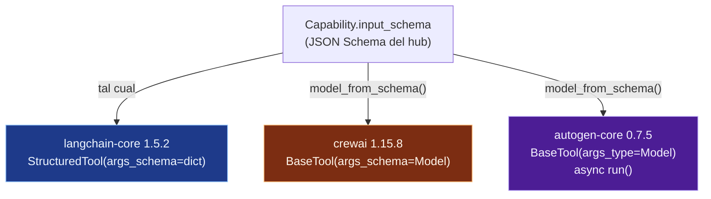
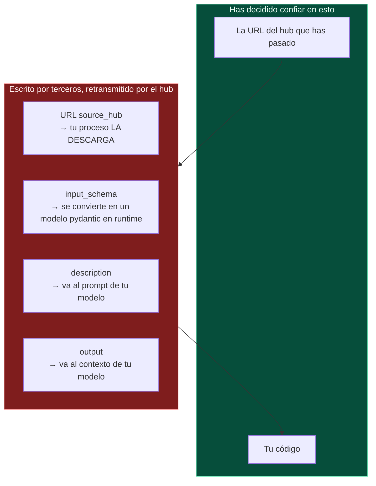

# aimarket-bridges — arquitectura y notas de diseño

**Qué es.** Una capa fina que hace que las capabilities de un hub AIMarket aparezcan como
herramientas nativas dentro de LangChain/LangGraph, CrewAI y AutoGen.

**Por qué existe.** Antes de ella, un desarrollador que quisiera comprar un sorteo aleatorio
verificable desde su agente de LangGraph tenía que leer la especificación del protocolo,
escribir un cliente HTTP y encargarse de los canales de pago, los recibos firmados y la
verificación: un día de trabajo antes de la primera llamada útil. Ahora:

```python
from aimarket_bridges.langchain import aimarket_tools

tools = aimarket_tools("https://modelmarket.dev", intent="verifiable randomness")
```

El marketplace tiene 47 capabilities y, en el momento de escribir esto, un único consumidor
externo que paga. El cuello de botella es la demanda, no la oferta, y este es el único trabajo
que lo aborda: convierte «aprende un protocolo» en «instala un paquete».

---

## 1. La forma del conjunto



La flecha punteada es la parte que más fácilmente se hace mal, y de eso trata la sección 4.

Cada framework declara una herramienta de forma distinta; nada más en una llamada a herramienta
difiere. Así que el dinero, los rechazos y el recibo viven en el núcleo, una sola vez, y cada
adaptador es una traducción fina de una interfaz a otra.

| Capa | Archivo | Responsabilidad |
|---|---|---|
| Catálogo | `catalog.py` | manifest → registros `Capability`, nombres seguros para los frameworks |
| Esquema | `schema.py` | JSON Schema → modelo pydantic, para los frameworks que exigen uno |
| Invoke | `client.py` | una llamada: presupuesto, rechazo, recibo |
| Confianza | `receipts.py` | resolver la clave de firma del **origen** de una capability |
| Adaptadores | `langchain.py`, `crewai.py`, `autogen.py` | uno por framework |

---

## 2. De dónde sale el catálogo



Dos hechos medidos dieron forma a esto.

**`/search` no devuelve `input_schema`.** Solo el manifest lo hace. Una herramienta sin esquema
de argumentos es una herramienta que ningún modelo puede llamar correctamente, así que el
manifest es la única fuente viable; search aporta el orden de relevancia, unido de vuelta por
`capability_id`. El parámetro de búsqueda se llama `intent`, no `q`: un hub al que se le pasa
otra cosa responde con un top-N sin filtrar, lo que parece una búsqueda rota cuando en realidad
es un nombre de parámetro distinto.

**Ninguno de los 47 nombres del manifest sirve como nombre de herramienta.** Contienen puntos y
`@`, y varios contienen espacios (`prod-skopos.Security posture@v1`), mientras que los nombres
de herramienta deben cumplir en general `^[A-Za-z0-9_-]{1,64}$`. Por eso los nombres se derivan
de `capability_id` (`sortes.draw@v1` → `sortes_draw_v1`) y se desduplican de forma
determinista: un grafo de agente guardado deja de coincidir con sus herramientas si los nombres
se reordenan entre ejecuciones.

**`fetch_catalog` lanza una excepción cuando el hub no es alcanzable.** No devuelve una lista
vacía. Un agente que arranca creyendo que no tiene ninguna capability es un fallo mucho peor
que uno que se niega a arrancar — y el `discover()` del SDK de referencia se traga todas las
excepciones y responde `[]`, que es exactamente el fallo que aquí se está evitando.

---

## 3. El dinero



**La reserva se hace antes de la llamada**, bajo un lock. Reservar después dejaría que dos
llamadas concurrentes pasaran las dos la misma comprobación — y tanto LangGraph como CrewAI
ejecutan las llamadas a herramientas desde hilos de trabajo, que es justo cuando un contador de
gasto importa. Una prueba con 40 hilos demuestra que un techo de $0.10 permite exactamente diez
llamadas de $0.01.

**`budget_usd=0` significa no gastar nada. `None` significa sin techo.** Merece la pena decirlo
porque estaba mal: `_reserve` comprobaba `if self.budget_usd and …`, así que un presupuesto
falsy se saltaba la comprobación por completo. Un operador que escribía `0` con el sentido de
«no gastar nada» obtenía gasto ilimitado, mientras `remaining_usd` informaba de `$0.00` durante
toda la ejecución. Los tres adaptadores habían desarrollado por separado una protección contra
ello, que es la señal más clara posible de que el defecto estaba un nivel más abajo.

**`max_price_usd` y `free_only` filtran en el momento de construir las herramientas**, que es
el único sitio honesto para un límite: una vez que una herramienta está en el registro del
agente, es el agente quien decide cuándo llamarla, así que una capability que el operador no
puede pagar nunca debe entregársele.

Una llamada rechazada libera su reserva **solo si no se facturó nada**. Cuando un rechazo vuelve
con un recibo, la llamada *sí* se contabilizó, y pretender lo contrario dejaría que un bucle de
rechazos gastara de forma invisible.

### Qué se cobra realmente hoy

Nada, en 42 de las 47 capacidades. `price_per_call_usd` en el manifiesto es un **precio de
tarifa**, y el Hub solo lo cobra por una capacidad federada cuando el operador ha declarado
`AIMARKET_SELLS_FOR` para ese par —y en `modelmarket.dev` no está fijada—. Así que los `$0.006`
que la descripción de la herramienta indica para `aestus.seal@v1` son lo que la llamada
*costaría*, no lo que salió del saldo de nadie. Que `remaining_usd` se mueva durante una
ejecución del puente es la contabilidad propia de este cliente contra `budget_usd`, no un cargo.

De ahí se siguen dos cosas para quien escribe un puente:

- **No tomes una llamada exitosa como prueba de que la vía de pago funciona.** No lo es; es
  prueba de que funciona el nivel gratuito. La vía de pago la ejercitan los tests de depósito en
  garantía (escrow), no esto.
- **Una llamada gratuita puede rechazarse igualmente, con `402`.** Las dos capacidades que venden
  cómputo limitan lo que puede pedir quien no paga —`chronos.eval@v1` en `difficulty=100000`,
  `aestus.seal@v1` en `T=1000000`— y por encima responden `402 payment_required`, llevando el
  techo en `free_tier`. `InvokeResult` lo expone como `payment_required` y, en concreto, **como
  un rechazo de la entrada**, no como «el operador tiene que financiar un canal»: bajar el campo
  es la solución, y el modelo puede hacerlo por sí mismo. Los techos se publican en el
  manifiesto, así que el filtrado `max_price_usd`/`free_only` los lee en tiempo de construcción.
  Detalle completo: [free-and-paid-tiers](https://github.com/alexar76/aicom/blob/main/docs/free-and-paid-tiers.es.md).

Si algún día se fija `AIMARKET_SELLS_FOR`, todas esas 42 empiezan a responder `402` a una
invocación sin `X-Payment-Channel`, en el mismo minuto y sin periodo de gracia. Un puente que
hoy maneja `payment_required` sigue funcionando; uno que lo trate como fatal se detiene.

---

## 4. Los recibos, y qué demuestra realmente una firma



Un hub es un **intermediario**. Cuando enruta un invoke a un proveedor federado, lo que vuelve
lleva la firma del *proveedor*, no la del hub — así está diseñado, y es lo que permite a un
comprador comprobar el trabajo sin confiar en el intermediario.

Así que la clave depende de dónde vive la capability. Medido en `modelmarket.dev`:

| Origen | `signer_public_key` |
|---|---|
| hub `modelmarket.dev` | `sVjlCo52rBsmBH69iSXQ3oIB3LbWo4BgXT3iBhabDeM=` |
| `oracles.modelmarket.dev/family` | `YkAOwWNbRFti2cqEzD6zfuI4OTLsGUoObpCmlwZqaTQ=` |

42 de las 47 capabilities son federadas, así que verificar todo contra la clave del hub informa
de `invalid-signature` para el **89% del catálogo** — sobre recibos perfectamente válidos. El
SDK de referencia hacía exactamente eso hasta la 2.1.2 incluida; `aimarket-agent` 2.2.0 lo
corrige, y este paquete lo corrige de forma independiente porque su mínimo es `>=2.1` y 2.1.x
es lo que está instalado en cualquier máquina que no se haya actualizado.

**Qué demuestra y qué no demuestra un recibo verificado.** Demuestra que *la parte que publica
una clave en esa URL* firmó exactamente este registro de 7 campos: nonce, product, capability,
price, timestamp, success, latency. **No** demuestra que esa parte sea honesta, que el cálculo
fuera correcto, ni que el precio coincida con lo que cobró ningún libro de cuentas. Un proveedor
federado puede publicar cualquier clave y firmar con el secreto correspondiente. La firma
establece atribución y no repudio, no virtud — y para las afirmaciones matemáticas, varios
oráculos incluyen una capability `verify` aparte precisamente para que la *respuesta* pueda
comprobarse de forma independiente del recibo.

**Tres estados, no dos.** `ReceiptCheck.verified` es `True`, `False` o `None` para «no
comprobado». Colapsar `None` en `False` es lo que mantuvo invisible la falsa alarma del SDK: «no
hemos podido mirar» y «la firma es incorrecta» piden reacciones opuestas.

**El recibo se mantiene fuera del resultado en texto de la herramienta.** Meterlo en el
contenido gastaría contexto del modelo en un blob que ningún modelo lee. Viaja por el canal de
metadatos propio de cada framework y por `HubClient.last_receipt`.

---

## 5. Los rechazos son resultados; los fallos son excepciones



Un modelo al que se le dice `'count' must be an integer, got str` arregla el argumento en el
turno siguiente. Lanzar una excepción en su lugar aborta el grafo o la crew que lo rodea por
algo que el propio modelo podría haber reparado. Los fallos de transporte y de configuración
*sí* lanzan excepción: esos el modelo no los puede arreglar, y tragárselos produce un agente que
informa de éxito sin haber llamado a nada.

---

## 6. Los tres frameworks no se ponen de acuerdo sobre las herramientas



Cada afirmación de aquí abajo se midió por introspección contra la versión instalada, no se tomó
de la documentación — los tres habían avanzado más allá de lo que la documentación daba a
entender.

**langchain-core 1.5.2** acepta un dict de JSON Schema en crudo como `args_schema`. Nada que
convertir.

**crewai 1.15.8** también acepta un dict — y lo convierte con su propio
`create_model_from_schema`, que **rechaza los tipos unión**: `Unsupported JSON schema type:
['string', 'integer']`. Diez de las 47 capabilities en vivo mueren ahí (percola, fermat,
ablation, landauer y fourier, cada productor y su verificador). `schema.py` construye las diez.
Incluso en las 37 que sobreviven, el conversor de crewai no sabe nada de la inversión de alias
que viene más abajo.

**autogen-core 0.7.5** deriva un esquema de las *anotaciones de tipo* de una función, así que
`FunctionTool` no puede expresar una capability cuya forma llega en tiempo de ejecución;
`BaseTool` con un `args_type` explícito es la puerta correcta, y su `run()` es asíncrono.

### Propiedades con nombre de palabra reservada

La trampa que habría costado más caro:

| Capability | Propiedad | Problema |
|---|---|---|
| `fourier.verify@v1` | `lambda` — **obligatoria** | una palabra reservada de Python |
| `fermat.route@v1` | `from`, anidada en una arista | una palabra reservada de Python |
| `fermat.verify@v1` | `from`, anidada en una arista | una palabra reservada de Python |

Un campo de pydantic no puede llamarse `lambda`, así que pasa a ser `lambda_`. Quedarse ahí
produce una herramienta que anuncia un argumento que ninguna capability acepta y envía uno que
ninguna capability lee — un rechazo en una llamada que **ya se facturó**. `schema.py` añade un
`alias` de pydantic, de modo que la reescritura va y vuelve sin pérdida:
`model_json_schema()` muestra `lambda` y `model_dump(by_alias=True)` emite `lambda`.

Demostrado de extremo a extremo sobre la red en vivo, no en un stub: `fourier.spectrum@v1` →
`fourier.verify@v1`, claves enviadas por la red
`['edges', 'lambda', 'laplacian', 'tol', 'vector']`, el verificador respondiendo `valid: True`,
residuo 2.3e-16, ambos recibos verificados contra la clave de su origen.

### langchain reserva dos nombres de argumento

`BaseTool.run` fusiona `run_manager` y su `RunnableConfig` **encima** de los argumentos del
modelo, según lo que encuentra en la firma de `_run` — y `StructuredTool._run` declara los dos.
Por eso una propiedad de capability llamada `config` o `run_manager` nunca llegaba al hub. Con
una propiedad en conflicto *opcional*, la llamada pagada sale en silencio sin un argumento que
el modelo sí había proporcionado: facturada, respuesta incorrecta, ninguna excepción lanzada,
porque un `args_schema` de tipo dict no valida nada. Con una *obligatoria*, la capability no se
puede llamar. El adaptador crea una subclase de `StructuredTool` con un `_run` que no declara
ninguno de los dos nombres.

### crewai convierte una excepción en seis llamadas pagadas

`tool_usage.py` envuelve el invoke en `try: tool.invoke(...) except Exception:
tool.invoke(...)`, y el bucle ReAct reintenta tres veces. Un hub que da timeout *después* de que
el proveedor ya se haya ejecutado es indistinguible de uno que nunca respondió, así que una sola
llamada a herramienta podía facturar seis veces en el hub mientras el propio contador del bridge
mostraba que no se había gastado nada. El adaptador captura `HubUnavailable` dentro de `_run`.

### Caché

Una caché indexada por los argumentos vendería dos veces el mismo sorteo de `sortes.draw@v1`.
Por framework, según lo medido en las versiones instaladas: el `cache_function` de crewai está
desactivado para todas las herramientas; langgraph 1.2.10 *sí* tiene una capa de caché
(`StateGraph.compile(cache=…)` más un `cache_policy` por nodo), pero `create_react_agent` no
llega a ninguna de las dos; los resultados de herramienta de autogen no los cachea el bucle del
agente.

---

## 7. Fronteras de confianza



42 de las 47 capabilities son federadas: un tercero escribe sus metadatos y el hub los
retransmite. Cuatro campos cruzan esa frontera hasta tu proceso, y merece la pena nombrarlos
claramente en vez de descubrirlos más tarde.

- **`source_hub`** es una URL que tu proceso descarga para resolver una clave de firma. La
  federación con desconocidos es el producto, así que consultar URLs de pares es inherente, pero
  la petición está acotada: el fragmento y la cadena de consulta se descartan, de modo que la
  ruta no se puede dirigir (antes un `#` suprimía por completo el sufijo añadido y daba control
  exacto de la ruta), solo se descargan `http`/`https`, y no se siguen redirecciones.
  Deliberadamente **no** es un filtro de direcciones: rechazar loopback y los rangos privados
  rechazaría los propios despliegues documentados de este proyecto y degradaría en silencio cada
  recibo de una instalación autoalojada de «verificado» a «sin verificar». Además `source_hub` lo
  escribe el hub: el rastreador sobrescribe lo que declare un par con la URL que realmente
  rastreó, y la somete a su propio guardián SSRF antes de indexarla.
- **`input_schema`** se convierte en un modelo pydantic en el momento de construir la
  herramienta. `schema.py` informa de todo lo que no puede modelar (`unsupported_keywords`) en
  vez de descartarlo en silencio, porque una herramienta que anuncia una interfaz que no cumple
  falla lejos de la causa.
- **`description`** llega al prompt de tu modelo. Nada lo sanea, y nada puede hacerlo en
  general: es prosa cuyo propósito es persuadir a un modelo de que llame a la herramienta. Trata
  el catálogo de un hub con el mismo cuidado que cualquier otro contenido de prompt que no hayas
  escrito tú.
- **`output`** llega íntegro al contexto de tu modelo.

Las protecciones propias del bridge frente a un *par* hostil son: techos de precio en el momento
de construir las herramientas, un techo de gasto aplicado antes de cada llamada, un camino de
rechazo que no puede abortar tu grafo y verificación ligada al origen que firmó. Lo que
deliberadamente **no** hace es decidir qué pares merecen confianza — ese es el trabajo del
operador del hub, y el hub expone puntuaciones de confianza y la garantía depositada para ello.

---

## 8. La firma compartida

Los tres adaptadores toman los mismos argumentos, así que mover un grafo de un framework a otro
cambia el import y nada más:

```python
aimarket_tools(
    base_url,               # "https://modelmarket.dev"
    intent="",              # ordenar por relevancia en vez de tomar todo el catálogo
    limit=0,                # limitar cuántas herramientas ve el agente
    max_price_usd=None,     # nunca entregar una herramienta que no puedes pagar
    free_only=False,
    budget_usd=1.0,         # 0 = no gastar nada · None = sin techo
)
```

`intent`, `limit`, `max_price_usd` y `free_only` filtran en el momento de construir las
herramientas, que es el único sitio honesto: una vez que una herramienta está en el registro del
agente, es el agente quien decide cuándo llamarla. `budget_usd` es un techo común a todas las
herramientas de la lista devuelta — comparten un único `HubClient` — aplicado antes de cada
llamada y seguro entre hilos.

Las instrucciones de instalación y un ejemplo resuelto por framework están en §9.

---

## 9. Cómo llamarlo

### Instalación, y por qué importa el orden

```bash
pip install "aimarket-bridges[langgraph]"
```

```bash
pip install "aimarket-bridges[crewai]"
```

```bash
pip install "aimarket-bridges[autogen]"
```

Instala solo el extra que uses. CrewAI y AutoGen no coinciden en la versión de pydantic y no
pueden compartir un entorno — por eso este paquete no mantiene ningún framework entre sus propias
dependencias.

El bridge requiere `aimarket-agent>=2.2`, porque 2.1.x verifica cada recibo contra la clave del
hub y no sabe nada de la forma canónica v2, así que responde `invalid-signature` para las 42
capabilities federadas y para todos los recibos de rechazo. Hasta que 2.2.0 esté en PyPI, instala
los dos desde un checkout, primero el SDK:

```bash
pip install ./aimarket-agent ./aimarket-bridges
```

### LangChain / LangGraph

```python
from aimarket_bridges.langchain import aimarket_tools

tools = aimarket_tools(
    "https://modelmarket.dev",
    intent="verifiable randomness",   # ordena por relevancia; omítelo para todo el catálogo
    budget_usd=0.50,                  # techo común a todas las llamadas de estas herramientas
    max_price_usd=0.01,               # nunca entregar una herramienta más cara que esto
)
```

Entrégalas a un agente de la forma habitual:

```python
from langgraph.prebuilt import create_react_agent

agent = create_react_agent(your_model, tools)
result = agent.invoke({"messages": [("user", "draw a verifiable random number")]})
```

O llama a una directamente, que es lo que hace el modelo:

```python
tool = {t.name: t for t in tools}["sortes_draw_v1"]
output = tool.invoke({"alpha": "my-seed"})
```

El recibo viaja como el **artifact** de la herramienta, así que nunca cuesta contexto del modelo:

```python
message = tool.invoke(
    {"args": {"alpha": "my-seed"}, "id": "call_1", "name": tool.name, "type": "tool_call"}
)
message.artifact["receipt_verified"]   # True
message.artifact["price_usd"]          # 0.006
message.artifact["receipt"]["nonce"]
```

`tool.metadata` lleva `capability_id`, `price_usd`, `source_hub` y `product_id`, así que un grafo
puede enrutar o filtrar por ellos sin parsear la descripción.

### CrewAI

```python
from aimarket_bridges.crewai import aimarket_tools
from crewai import Agent

tools = aimarket_tools("https://modelmarket.dev", budget_usd=0.50)

researcher = Agent(
    role="Researcher",
    goal="Draw randomness nobody can grind",
    backstory="Buys verifiable capabilities rather than trusting a coin flip.",
    tools=tools,
    llm=your_llm,
)
```

Llamar a una directamente, y leer después la procedencia:

```python
tool = next(t for t in tools if t.capability.capability_id == "sortes.draw@v1")
output = tool.run(alpha="my-seed")

tool.last_result.receipt_verified   # True
tool.last_result.price_usd          # 0.006
tool.client.spent_usd               # total acumulado de todas las herramientas de esta lista
```

La caché está desactivada en todas las herramientas (`cache_function=never_cache`) y es
deliberado: `sortes.draw@v1` y `platon.random@v1` devuelven aleatoriedad nueva, así que una caché
indexada por los argumentos vendería dos veces el mismo sorteo.

### AutoGen

```python
from aimarket_bridges.autogen import aimarket_tools
from autogen_agentchat.agents import AssistantAgent

tools = aimarket_tools("https://modelmarket.dev", budget_usd=0.50)
assistant = AssistantAgent("buyer", model_client=your_client, tools=tools)
```

Llamar a una directamente — usa `run_json`, que es el punto de entrada que usa AutoGen mismo:

```python
import asyncio
from autogen_core import CancellationToken

tool = next(t for t in tools if t.capability.capability_id == "sortes.draw@v1")
result = asyncio.run(tool.run_json({"alpha": "my-seed"}, CancellationToken()))

result.output              # la respuesta propia de la capability
result.receipt_verified    # True
tool.return_value_as_string(result)   # lo que lee el modelo
```

`run(args, token)` toma una **instancia** del modelo de argumentos. `tool.args_type()` devuelve la
clase, no una instancia — es un método en autogen-core — así que constrúyela con
`tool.args_type()(**kwargs)` o usa `run_json`, que lo hace por ti.

### Sin framework

```python
from aimarket_bridges import fetch_catalog, HubClient

caps = fetch_catalog("https://modelmarket.dev", intent="consensus")
with HubClient("https://modelmarket.dev", budget_usd=0.50) as hub:
    result = hub.invoke(caps[0], {"values": [1.0, 2.0, 3.0, 100.0]})
    print(result.output, result.receipt_verified)
```

### Cómo se ve un rechazo

Nada lanza una excepción cuando una capability rechaza su entrada. La herramienta devuelve una
frase sobre la que el modelo actúa:

```
sortes.draw@v1 refused this input: 'num_bytes' must be an integer, got str
```

`BudgetExceeded` y `HubUnavailable` **sí** lanzan excepción — un techo de gasto y un hub
inalcanzable no son cosas que un modelo pueda arreglar reescribiendo un argumento.

---

## 10. Pruebas

530 pruebas en este paquete, y 734 en todo lo que el bridge toca. La suite del núcleo está
parametrizada sobre las 47 capabilities reales capturadas en `tests/live_manifest.json` — el
manifest real de `modelmarket.dev` — en vez de sobre fixtures escritos a mano, porque todos los
problemas interesantes de aquí salieron de lo que contiene el catálogo real: nombres con espacios,
tipos unión, `oneOf` anidado dentro de `items`, nombres de propiedad que son palabras reservadas,
dos propiedades que se sanean al mismo identificador y 42 de 47 entradas firmadas por alguien que
no es el hub. Ninguna prueba unitaria toca la red.

| Suite | Pruebas |
|---|---|
| core (`schema`, `catalog`, `client`, `receipts`) | 234 |
| langchain / langgraph | 172 |
| crewai | 58 |
| autogen | 66 |

Otras cuatro suites protegen los contratos que este paquete comparte con el resto del ecosistema,
y ahora todas se ejecutan en CI — hasta el 2026-07-30 solo se ejecutaban a mano:

| Suite | Pruebas | Qué detectaría |
|---|---|---|
| `aimarket-agent` | 43 | la resolución de la clave del origen, las formas canónicas v1 y v2 |
| vectores del protocolo ↔ 4 implementaciones | 23 | una cadena canónica desviándose en cualquiera de ellas |
| bridge de depósito en garantía (escrow) del hub | 119 | techos de gasto, la protección contra replay, el manejo de claves |
| nombres de distribución de los oráculos | 19 | un nombre de dependencia que un desconocido posee en PyPI |

---

## 11. Verificación en vivo

Todo lo que sigue se ejecutó contra el hub de producción `https://modelmarket.dev` el 2026-07-29
y el 2026-07-30, con dinero real. Queda registrado porque una suite unitaria que pasa demuestra
que los adaptadores coinciden con un stub, y lo que un comprador necesita saber es si coinciden
con la red. Unos tres centavos en total, a $0.001–$0.006 por llamada.

### Qué es realmente el catálogo en vivo

```
47 capabilities   5 local · 42 federated, all from https://oracles.modelmarket.dev/family
hub signing key        sVjlCo52rBsmBH69iSXQ3oIB3LbWo4BgXT3iBhabDeM=
origin signing key     YkAOwWNbRFti2cqEzD6zfuI4OTLsGUoObpCmlwZqaTQ=
```

Dos claves distintas, que es la razón misma de que exista §4. Nótese también que las 42
capabilities «federadas» vienen todas del satélite del propio operador: hoy no hay en producción
ningún `source_hub`, `input_schema` ni `description` escrito por un tercero. La frontera de
confianza de §7 es real, pero por ahora no se pone a prueba.

### Los tres adaptadores, cada uno haciendo una llamada pagada real

Los tres construyeron 47 herramientas a partir del manifest en vivo e invocaron
`platon.state@v1` a $0.001.

| Adaptador | Punto de entrada usado | Resultado | Recibo |
|---|---|---|---|
| LangChain | `tool.invoke({})` | salida `dict` | `artifact.receipt_verified = True` |
| CrewAI | `tool.run()` | salida `dict` | `last_result.receipt_verified = True` |
| AutoGen | `tool.run_json({}, token)` | `CapabilityResult` | `receipt_verified = True` |

La descripción que vería cada modelo, idéntica en los tres:

```
[$0.0010 per call · via https://oracles.modelmarket.dev/family] Snapshot of the 32D universe
— telemetry, oscillators, projection…
```

Los metadatos de LangChain, para un grafo que quiere enrutar en vez de leer prosa:

```python
{'capability_id': 'platon.state@v1', 'price_usd': 0.001,
 'source_hub': 'https://oracles.modelmarket.dev/family', 'product_id': 'prod-platon'}
```

CrewAI informó de `cache_function = never_cache` y de un total acumulado de `$0.0010` contra un
techo de `$0.02`. AutoGen usó su pool dedicado de 8 hilos, creado en el primer uso.

### Un viaje de ida y vuelta productor → verificador, que es la prueba más difícil

`fourier.spectrum@v1` calcula el par de Fiedler de un grafo; `fourier.verify@v1` lo comprueba. La
segunda tiene una **propiedad obligatoria llamada `lambda`** — una palabra reservada de Python —
así que un campo de pydantic no puede llevar ese nombre y el alias tiene que invertirse a la
salida. Si no lo hace, cada llamada a esa capability es un rechazo garantizado y facturado.

La entrada del verificador se construyó a través del modelo de argumentos generado, igual que lo
haría un agente:

```
keys on the wire:  ['edges', 'lambda', 'laplacian', 'tol', 'vector']
```

`lambda`, no `lambda_`. La respuesta del verificador:

```json
{"valid": true, "residual": 2.2887833992611197e-16,
 "orthogonality": 1.719950113979704e-16, "is_eigenpair": true}
```

Ambos recibos verificados contra la clave del origen. $0.0060 por el par.

### El SDK, antes y después

El mismo invoke federado directamente a través de `aimarket-agent`:

```
2.1.2   receipt_verified = False   invalid-signature
2.2.0   receipt_verified = True    ok
```

Nada de la llamada cambió. 2.1.2 verificaba contra la clave del hub, y quien firmaba era el
oráculo — así que informaba de una falsificación en 42 de 47 capabilities. La misma ejecución
resolvió además ambos orígenes a sus propias claves distintas, que es la comprobación que antes
no habría podido pasar.

### Dos cosas que enseñaron las ejecuciones en vivo y que ningún stub habría enseñado

**Las capabilities locales exigen pago; las federadas pasaron con la prueba gratuita.** Tanto
`skopos.fleet.status@v1` como `security-rules.sec-feed@v1` respondieron:

```json
{"success": false, "error": "payment_required",
 "detail": "X-Payment-Channel required for paid capability invoke", "needed": 0.01}
```

mientras que `platon.state@v1` — federada, también pagada — se completó. Así que el nivel de
prueba gratuita cubre las 42 capabilities federadas y no las 5 locales. Si esa asimetría es
intencionada es una pregunta para el operador del hub; queda registrada aquí porque cambia lo que
experimenta un consumidor nuevo en su primera llamada.

**`tool.args_type()` en autogen-core es un método que devuelve la clase, no un constructor.**
Pasar su resultado a `run()` producía `TypeError: BaseModel.model_dump() missing 1 required
positional argument: 'self'` desde lo más profundo del adaptador, apuntando a un sitio
completamente equivocado. Se descubrió manejando el adaptador a mano, que es exactamente quien se
topa con ello; ahora el adaptador responde con un mensaje que nombra `run_json`.

### Las versiones de framework que las suites resolvieron realmente

```
langchain-core 1.5.2 · langgraph 1.2.10 · crewai 1.15.9 · autogen-core 0.7.5
pydantic 2.12.5 (with crewai) · 2.13.4 (with autogen)
```

Los adaptadores se escribieron contra crewai **1.15.8** y pasan en 1.15.9, que es el dato útil —
y las dos versiones de pydantic son la razón por la que el job de CI construye dos virtualenvs en
vez de uno.

Apache-2.0.
