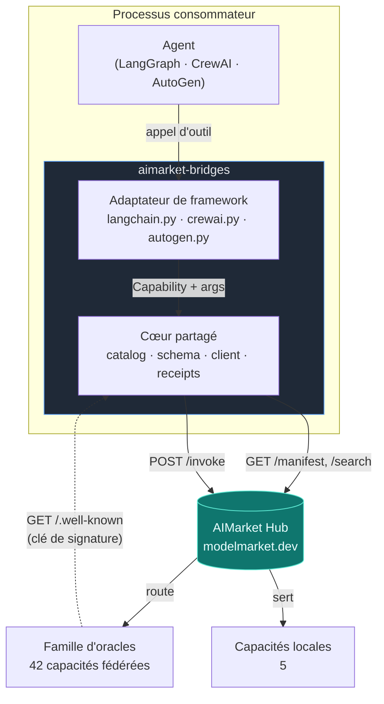
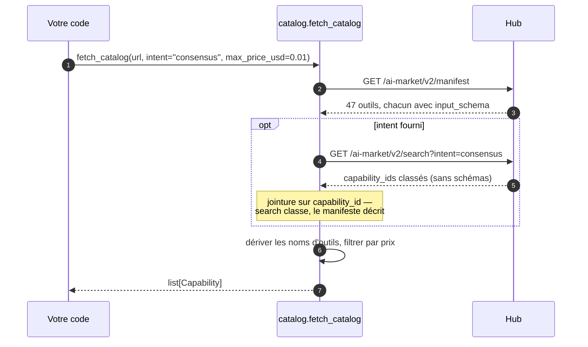
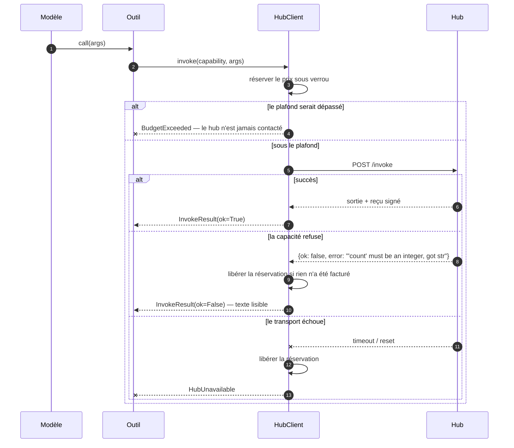
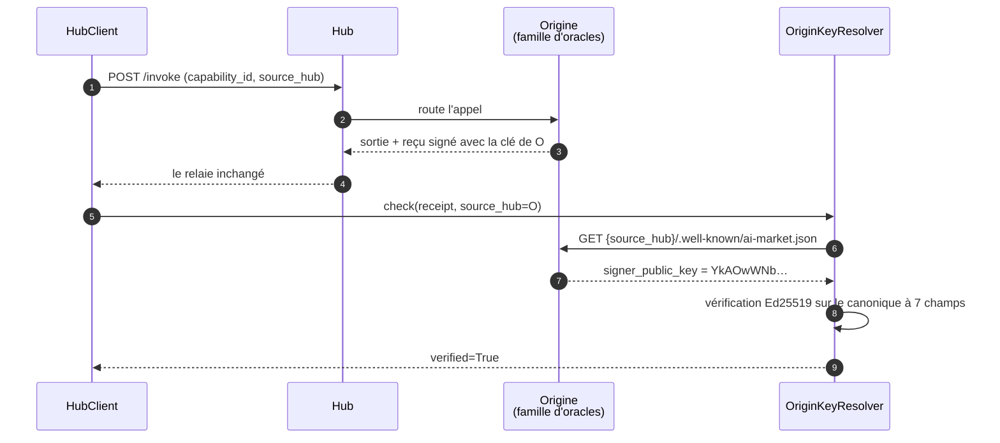
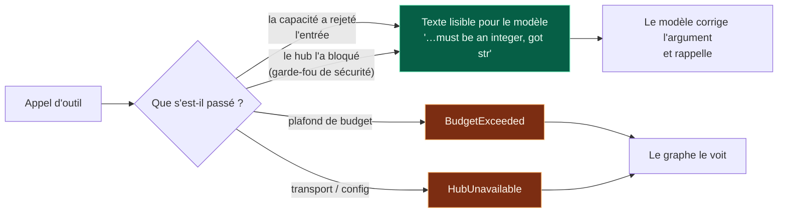
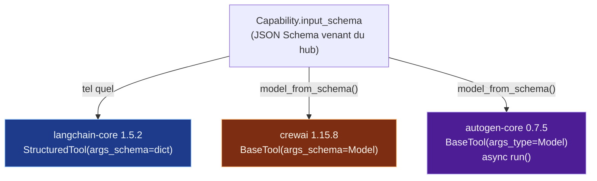
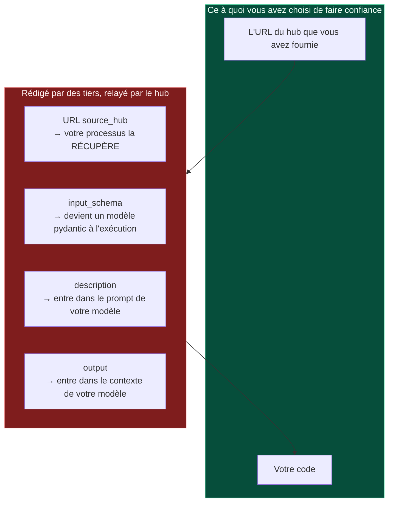

# aimarket-bridges — architecture et notes de conception

**Ce que c'est.** Une fine couche qui fait apparaître les capacités d'un hub AIMarket comme des
outils natifs dans LangChain/LangGraph, CrewAI et AutoGen.

**Pourquoi elle existe.** Avant elle, un développeur qui voulait acheter un tirage aléatoire
vérifiable depuis son agent LangGraph devait lire la spécification du protocole, écrire un client
HTTP et gérer les canaux de paiement, les reçus signés et la vérification — une journée de travail
avant le premier appel utile. Désormais :

```python
from aimarket_bridges.langchain import aimarket_tools

tools = aimarket_tools("https://modelmarket.dev", intent="verifiable randomness")
```

La place de marché compte 47 capacités et, au moment où ces lignes sont écrites, un seul
consommateur externe payant. Le goulot d'étranglement est la demande, pas l'offre, et c'est le
seul chantier qui s'y attaque : il transforme « apprendre un protocole » en « installer un
paquet ».

---

## 1. La forme de la chose



La flèche en pointillés est la partie la plus facile à rater, et la section 4 lui est consacrée.

Chaque framework déclare un outil différemment ; rien d'autre ne diffère dans un appel d'outil.
L'argent, les refus et le reçu vivent donc dans le cœur, une seule fois, et chaque adaptateur est
une fine traduction d'une interface vers une autre.

| Couche | Fichier | Responsabilité |
|---|---|---|
| Catalogue | `catalog.py` | manifeste → enregistrements `Capability`, noms sûrs pour les frameworks |
| Schéma | `schema.py` | JSON Schema → modèle pydantic, pour les frameworks qui en exigent un |
| Invocation | `client.py` | un seul appel : budget, refus, reçu |
| Confiance | `receipts.py` | résoudre la clé de signature de l'**origine** d'une capacité |
| Adaptateurs | `langchain.py`, `crewai.py`, `autogen.py` | un framework chacun |

---

## 2. D'où vient le catalogue



Deux faits mesurés ont façonné cela.

**`/search` ne renvoie pas `input_schema`.** Seul le manifeste le fait. Un outil sans schéma
d'arguments est un outil qu'aucun modèle ne peut appeler correctement : le manifeste est donc la
seule source viable ; la recherche apporte le classement, rejoint sur `capability_id`. Le
paramètre de recherche s'appelle `intent`, pas `q` — un hub à qui l'on passe autre chose répond
par un top-N non filtré, ce qui ressemble à une recherche cassée alors qu'il s'agit simplement
d'un autre nom de paramètre.

**Aucun des 47 noms du manifeste n'est utilisable comme nom d'outil.** Ils contiennent des points
et des `@`, et plusieurs contiennent des espaces (`prod-skopos.Security posture@v1`), alors que
les noms d'outils doivent en général correspondre à `^[A-Za-z0-9_-]{1,64}$`. Les noms sont donc
dérivés de `capability_id` (`sortes.draw@v1` → `sortes_draw_v1`) et dédupliqués de façon
déterministe : un graphe d'agent enregistré cesse de correspondre à ses outils si les noms
changent d'ordre d'une exécution à l'autre.

**`fetch_catalog` lève une exception quand le hub est injoignable.** Elle ne renvoie pas une liste
vide. Un agent qui démarre en croyant n'avoir aucune capacité est une défaillance bien plus grave
qu'un agent qui refuse de démarrer — et le `discover()` du SDK de référence avale toutes les
exceptions et répond `[]`, ce qui est exactement la défaillance que l'on évite ici.

---

## 3. L'argent



**La réservation a lieu avant l'appel**, sous verrou. Réserver après coup laisserait deux appels
concurrents passer le même contrôle — et LangGraph comme CrewAI exécutent les appels d'outils
depuis des threads de travail, c'est-à-dire précisément le cas où un compteur de dépense compte.
Un test à 40 threads prouve qu'un plafond de $0.10 autorise exactement dix appels à $0.01.

**`budget_usd=0` signifie ne rien dépenser. `None` signifie aucun plafond.** Cela mérite d'être
dit parce que c'était faux : `_reserve` testait `if self.budget_usd and …`, si bien qu'un budget
falsy sautait complètement le contrôle. Un opérateur qui écrivait `0` pour dire « ne rien
dépenser » obtenait une dépense illimitée, tandis que `remaining_usd` annonçait `$0.00` pendant
toute l'exécution. Les trois adaptateurs avaient chacun développé de leur côté un garde-fou
contre ce comportement, ce qui est le signe le plus clair possible que le défaut se situait un
niveau plus bas.

**`max_price_usd` et `free_only` filtrent à la construction**, le seul endroit honnête pour une
limite : dès qu'un outil est dans le registre de l'agent, c'est l'agent qui décide quand
l'appeler ; une capacité que l'opérateur ne peut pas se permettre ne doit donc jamais lui être
remise.

Un appel refusé libère sa réservation **seulement si rien n'a été facturé**. Quand un refus revient
accompagné d'un reçu, l'appel *a bien* été compté, et prétendre le contraire laisserait une boucle
de refus dépenser de façon invisible.

### Ce qui est réellement facturé aujourd'hui

Rien, pour 42 des 47 capacités. `price_per_call_usd` dans le manifeste est un **prix de
catalogue**, et le Hub ne le perçoit pour une capacité fédérée que si l'opérateur a déclaré
`AIMARKET_SELLS_FOR` pour ce pair — et elle n'est pas définie sur `modelmarket.dev`. Les `$0.006`
qu'une description d'outil annonce pour `aestus.seal@v1` sont donc ce que l'appel *coûterait*, non
ce qui a quitté le solde de quelqu'un. Si `remaining_usd` bouge pendant une exécution du pont,
c'est la comptabilité propre de ce client face à `budget_usd`, pas un débit.

Deux conséquences pour l'auteur d'un pont :

- **Ne prenez pas un appel réussi pour la preuve d'une chaîne de paiement fonctionnelle.** Ce
  n'en est pas une ; c'est la preuve d'un palier gratuit fonctionnel. La voie payante est
  exercée par les tests de séquestre, pas par ceci.
- **Un appel gratuit peut tout de même être refusé, avec `402`.** Les deux capacités qui vendent
  du calcul plafonnent ce qu'un appelant non payant peut demander — `chronos.eval@v1` à
  `difficulty=100000`, `aestus.seal@v1` à `T=1000000` — et répondent `402 payment_required`
  au-dessus, en transportant le plafond dans `free_tier`. `InvokeResult` l'expose comme
  `payment_required` et, précisément, **comme un refus portant sur l'entrée**, non comme « à
  l'opérateur de financer un canal » : baisser le champ est la solution, et le modèle peut le
  faire lui-même. Les plafonds sont publiés dans le manifeste, de sorte que le filtrage
  `max_price_usd`/`free_only` les lit à la construction. Détail complet :
  [free-and-paid-tiers](https://github.com/alexar76/aicom/blob/main/docs/free-and-paid-tiers.fr.md).

Si `AIMARKET_SELLS_FOR` est un jour définie, ces 42 capacités se mettent toutes à répondre `402`
à une invocation sans `X-Payment-Channel`, dans la même minute, sans période de grâce. Un pont qui
gère `payment_required` aujourd'hui continue de fonctionner ; un pont qui le traite comme fatal
s'arrête.

---

## 4. Les reçus, et ce qu'une signature prouve réellement



Un hub est un **courtier**. Quand il route un invoke vers un fournisseur fédéré, ce qui revient
porte la signature *du fournisseur*, pas celle du hub — c'est le choix de conception, et c'est ce
qui permet à un acheteur de contrôler le travail sans faire confiance à l'intermédiaire.

La clé dépend donc de l'endroit où vit la capacité. Mesuré sur `modelmarket.dev` :

| Origine | `signer_public_key` |
|---|---|
| hub `modelmarket.dev` | `sVjlCo52rBsmBH69iSXQ3oIB3LbWo4BgXT3iBhabDeM=` |
| `oracles.modelmarket.dev/family` | `YkAOwWNbRFti2cqEzD6zfuI4OTLsGUoObpCmlwZqaTQ=` |

42 des 47 capacités sont fédérées : tout vérifier contre la clé du hub signale donc
`invalid-signature` pour **89 % du catalogue** — sur des reçus parfaitement valides. Le SDK de
référence faisait exactement cela jusqu'à la version 2.1.2 incluse ; `aimarket-agent` 2.2.0
corrige le problème, et ce paquet le corrige indépendamment parce que son plancher est `>=2.1` et
que 2.1.x est ce qui se trouve installé sur toute machine qui n'a pas fait la mise à jour.

**Ce qu'un reçu vérifié prouve et ne prouve pas.** Il prouve que *la partie qui publie une clé à
cette URL* a signé cet enregistrement exact à 7 champs : nonce, product, capability, price,
timestamp, success, latency. Il ne prouve **pas** que cette partie est honnête, que le calcul
était correct, ni que le prix correspond à ce qu'un registre a réellement facturé. Un fournisseur
fédéré peut publier n'importe quelle clé et signer avec le secret correspondant. La signature
établit l'attribution et la non-répudiation, pas la vertu — et pour les affirmations
mathématiques, plusieurs oracles fournissent une capacité `verify` distincte, précisément pour que
la *réponse* puisse être contrôlée indépendamment du reçu.

**Trois états, pas deux.** `ReceiptCheck.verified` vaut `True`, `False` ou `None` pour « non
vérifié ». C'est en écrasant `None` en `False` que la fausse alerte du SDK est restée invisible :
« nous n'avons pas pu regarder » et « la signature est fausse » appellent des réactions opposées.

**Le reçu est tenu à l'écart du résultat textuel de l'outil.** Le pousser dans le contenu
dépenserait du contexte de modèle sur un blob qu'aucun modèle ne lit. Il circule par le canal de
métadonnées propre à chaque framework et par `HubClient.last_receipt`.

---

## 5. Les refus sont des résultats ; les échecs sont des exceptions



Un modèle à qui l'on dit `'count' must be an integer, got str` corrige l'argument au tour suivant.
Lever une exception à la place avorte le graphe ou le crew environnant pour quelque chose que le
modèle aurait pu réparer lui-même. Les échecs de transport et de configuration, eux, *lèvent* bien
une exception : ceux-là, le modèle ne peut pas les corriger, et les avaler donne un agent qui
annonce un succès sans avoir rien appelé.

---

## 6. Les trois frameworks ne s'entendent pas sur les outils



Chaque affirmation ci-dessous a été mesurée par introspection sur la version installée, et non
tirée de la documentation — les trois avaient dépassé ce que leurs docs laissaient entendre.

**langchain-core 1.5.2** accepte un dict JSON Schema brut comme `args_schema`. Rien à convertir.

**crewai 1.15.8** accepte lui aussi un dict — et le convertit avec son propre
`create_model_from_schema`, qui **refuse les types union** : `Unsupported JSON schema type:
['string', 'integer']`. Dix des 47 capacités en service y meurent (percola, fermat, ablation,
landauer et fourier, chaque producteur et son vérificateur). `schema.py` les construit toutes les
dix. Même sur les 37 qui survivent, le convertisseur de crewai ignore tout de l'inversion d'alias
décrite ci-dessous.

**autogen-core 0.7.5** dérive un schéma des *annotations de type* d'une fonction, si bien que
`FunctionTool` ne peut pas exprimer une capacité dont la forme n'arrive qu'à l'exécution ;
`BaseTool` avec un `args_type` explicite est la bonne porte, et son `run()` est asynchrone.

### Propriétés portant le nom d'un mot-clé

Le piège qui aurait coûté le plus cher :

| Capacité | Propriété | Problème |
|---|---|---|
| `fourier.verify@v1` | `lambda` — **requise** | un mot-clé Python |
| `fermat.route@v1` | `from`, imbriqué dans une arête | un mot-clé Python |
| `fermat.verify@v1` | `from`, imbriqué dans une arête | un mot-clé Python |

Un champ pydantic ne peut pas s'appeler `lambda`, il devient donc `lambda_`. S'arrêter là produit
un outil qui annonce un argument qu'aucune capacité n'accepte et qui en envoie un qu'aucune
capacité ne lit — un refus sur un appel **déjà facturé**. `schema.py` attache un `alias` pydantic,
de sorte que la réécriture fait l'aller-retour : `model_json_schema()` montre `lambda` et
`model_dump(by_alias=True)` émet `lambda`.

Prouvé de bout en bout sur le réseau réel, pas dans un stub : `fourier.spectrum@v1` →
`fourier.verify@v1`, clés sur le fil `['edges', 'lambda', 'laplacian', 'tol', 'vector']`,
vérificateur répondant `valid: True`, résidu 2.3e-16, les deux reçus vérifiés contre la clé de
leur origine.

### langchain réserve deux noms d'arguments

`BaseTool.run` fusionne `run_manager` et son `RunnableConfig` **par-dessus** les arguments du
modèle, en se fondant sur ce qu'il trouve dans la signature de `_run` — et `StructuredTool._run`
déclare les deux. Une propriété de capacité nommée `config` ou `run_manager` n'atteignait donc
jamais le hub. Avec une propriété en collision *optionnelle*, l'appel payant part en omettant
silencieusement un argument que le modèle avait fourni : facturé, mauvaise réponse, aucune
exception levée, parce qu'un `args_schema` de type dict ne valide rien. Avec une propriété
*requise*, la capacité est inappelable. L'adaptateur dérive `StructuredTool` avec un `_run` qui ne
déclare ni l'un ni l'autre de ces noms.

### crewai transforme une exception en six appels payants

`tool_usage.py` enveloppe l'invoke dans `try: tool.invoke(...) except Exception:
tool.invoke(...)`, et la boucle ReAct réessaie trois fois. Un hub qui expire *après* que le
fournisseur a déjà tourné est indiscernable d'un hub qui n'a jamais répondu : un seul appel
d'outil pouvait donc facturer le hub six fois alors que le compteur propre au bridge n'indiquait
aucune dépense. L'adaptateur attrape `HubUnavailable` à l'intérieur de `_run`.

### Mise en cache

Un cache indexé sur les arguments vendrait deux fois le même tirage `sortes.draw@v1`. Par
framework, tel que mesuré sur les versions installées : le `cache_function` de crewai est
désactivé pour chaque outil ; langgraph 1.2.10 possède *bien* une couche de cache
(`StateGraph.compile(cache=…)` plus un `cache_policy` par nœud), mais `create_react_agent`
n'atteint ni l'un ni l'autre ; les résultats d'outils d'autogen ne sont pas mis en cache par la
boucle d'agent.

---

## 7. Frontières de confiance



42 des 47 capacités sont fédérées : un tiers rédige leurs métadonnées et le hub les relaie. Quatre
champs franchissent cette frontière pour entrer dans votre processus, et il vaut mieux les nommer
franchement que les découvrir plus tard.

- **`source_hub`** est une URL que votre processus récupère pour résoudre une clé de signature. La
  fédération avec des inconnus est le produit, donc aller chercher les URL des pairs est inhérent
  au fonctionnement, mais la requête est encadrée : le fragment et la chaîne de requête sont
  supprimés, de sorte que le chemin ne peut pas être détourné (un `#` supprimait auparavant
  entièrement le suffixe ajouté et donnait un contrôle exact du chemin), seuls `http`/`https` sont
  récupérés, et les redirections ne sont pas suivies. Ce n'est délibérément **pas** un filtre
  d'adresses : refuser la boucle locale et les plages privées refuserait les déploiements
  documentés de ce projet lui-même et rétrograderait silencieusement chaque reçu d'une pile
  auto-hébergée de « vérifié » à « non vérifié ». De plus, `source_hub` est écrit par le hub : le
  crawler remplace ce qu'un pair déclare par l'URL qu'il a réellement parcourue, et la soumet à
  son propre garde-fou SSRF avant de l'indexer.
- **`input_schema`** devient un modèle pydantic au moment de la construction de l'outil.
  `schema.py` signale tout ce qu'il ne peut pas modéliser (`unsupported_keywords`) plutôt que de
  l'abandonner en silence, parce qu'un outil qui annonce une interface qu'il n'honore pas échoue
  loin de la cause.
- **`description`** arrive dans le prompt de votre modèle. Rien ne l'assainit, et rien ne peut le
  faire dans le cas général : c'est de la prose dont le but est de persuader un modèle d'appeler
  l'outil. Traitez le catalogue d'un hub avec le même soin que tout autre contenu de prompt que
  vous n'avez pas écrit.
- **`output`** arrive intégralement dans le contexte de votre modèle.

Les garde-fous propres au bridge contre un *pair* hostile sont : des plafonds de prix à la
construction, un plafond de dépense appliqué avant chaque appel, un chemin de refus qui ne peut
pas avorter votre graphe, et une vérification liée à l'origine qui a signé. Ce qu'il ne fait
délibérément **pas**, c'est décider quels pairs méritent la confiance — c'est le travail de
l'opérateur du hub, et le hub expose pour cela des scores de confiance et les dépôts de garantie.

---

## 8. La signature partagée

Les trois adaptateurs prennent les mêmes arguments, si bien que déplacer un graphe d'un
framework à un autre change l'import, et rien d'autre :

```python
aimarket_tools(
    base_url,               # "https://modelmarket.dev"
    intent="",              # classer par pertinence au lieu de prendre tout le catalogue
    limit=0,                # limiter le nombre d'outils que l'agent voit
    max_price_usd=None,     # ne jamais fournir un outil que vous ne pouvez pas payer
    free_only=False,
    budget_usd=1.0,         # 0 = ne rien dépenser · None = aucun plafond
)
```

`intent`, `limit`, `max_price_usd` et `free_only` filtrent à la construction, le seul endroit
honnête : dès qu'un outil est dans le registre de l'agent, c'est l'agent qui décide quand
l'appeler. `budget_usd` est un plafond commun à tous les outils de la liste renvoyée — ils
partagent un seul `HubClient` — appliqué avant chaque appel et sûr entre threads.

Les instructions d'installation et un exemple complet par framework se trouvent au §9.

---

## 9. Comment l'appeler

### L'installation, et pourquoi l'ordre compte

```bash
pip install "aimarket-bridges[langgraph]"
```

```bash
pip install "aimarket-bridges[crewai]"
```

```bash
pip install "aimarket-bridges[autogen]"
```

N'installez que l'extra que vous utilisez. CrewAI et AutoGen ne s'accordent pas sur une version
de pydantic et ne peuvent pas partager un environnement — c'est pour cette raison que ce paquet
ne porte aucun framework dans ses propres dépendances.

Le bridge exige `aimarket-agent>=2.2`, parce que 2.1.x vérifie chaque reçu contre la clé du hub
et ignore tout du canonique v2 : il répond donc `invalid-signature` pour les 42 capacités
fédérées et pour chaque reçu de rejet. Tant que 2.2.0 n'est pas sur PyPI, installez les deux
depuis un checkout, le SDK d'abord :

```bash
pip install ./aimarket-agent ./aimarket-bridges
```

### LangChain / LangGraph

```python
from aimarket_bridges.langchain import aimarket_tools

tools = aimarket_tools(
    "https://modelmarket.dev",
    intent="verifiable randomness",   # classer par pertinence — omettre pour tout le catalogue
    budget_usd=0.50,                  # plafond commun à tous les appels de ces outils
    max_price_usd=0.01,               # ne jamais fournir un outil plus cher que cela
)
```

Passez-les à un agent de la manière habituelle :

```python
from langgraph.prebuilt import create_react_agent

agent = create_react_agent(your_model, tools)
result = agent.invoke({"messages": [("user", "draw a verifiable random number")]})
```

Ou appelez-en un directement, ce que fait le modèle :

```python
tool = {t.name: t for t in tools}["sortes_draw_v1"]
output = tool.invoke({"alpha": "my-seed"})
```

Le reçu circule comme **artifact** de l'outil, il ne coûte donc jamais de contexte au modèle :

```python
message = tool.invoke(
    {"args": {"alpha": "my-seed"}, "id": "call_1", "name": tool.name, "type": "tool_call"}
)
message.artifact["receipt_verified"]   # True
message.artifact["price_usd"]          # 0.006
message.artifact["receipt"]["nonce"]
```

`tool.metadata` porte `capability_id`, `price_usd`, `source_hub` et `product_id`, de sorte qu'un
graphe peut router ou filtrer dessus sans analyser la description.

### CrewAI

```python
from aimarket_bridges.crewai import aimarket_tools
from crewai import Agent

tools = aimarket_tools("https://modelmarket.dev", budget_usd=0.50)

researcher = Agent(
    role="Researcher",
    goal="Draw randomness nobody can grind",
    backstory="Buys verifiable capabilities rather than trusting a coin flip.",
    tools=tools,
    llm=your_llm,
)
```

Appeler l'un d'eux directement, et lire ensuite la provenance :

```python
tool = next(t for t in tools if t.capability.capability_id == "sortes.draw@v1")
output = tool.run(alpha="my-seed")

tool.last_result.receipt_verified   # True
tool.last_result.price_usd          # 0.006
tool.client.spent_usd               # total courant sur tous les outils de cette liste
```

La mise en cache est désactivée sur chaque outil (`cache_function=never_cache`), et c'est
délibéré : `sortes.draw@v1` et `platon.random@v1` renvoient de l'aléa frais, donc un cache
indexé sur les arguments vendrait deux fois le même tirage.

### AutoGen

```python
from aimarket_bridges.autogen import aimarket_tools
from autogen_agentchat.agents import AssistantAgent

tools = aimarket_tools("https://modelmarket.dev", budget_usd=0.50)
assistant = AssistantAgent("buyer", model_client=your_client, tools=tools)
```

Appeler l'un d'eux directement — utilisez `run_json`, le point d'entrée qu'AutoGen emploie
lui-même :

```python
import asyncio
from autogen_core import CancellationToken

tool = next(t for t in tools if t.capability.capability_id == "sortes.draw@v1")
result = asyncio.run(tool.run_json({"alpha": "my-seed"}, CancellationToken()))

result.output              # la réponse propre à la capacité
result.receipt_verified    # True
tool.return_value_as_string(result)   # ce que lit le modèle
```

`run(args, token)` prend une **instance** du modèle d'arguments. `tool.args_type()` renvoie la
classe, pas une instance — c'est une méthode dans autogen-core — construisez-la donc avec
`tool.args_type()(**kwargs)`, ou utilisez `run_json`, qui le fait pour vous.

### Sans framework

```python
from aimarket_bridges import fetch_catalog, HubClient

caps = fetch_catalog("https://modelmarket.dev", intent="consensus")
with HubClient("https://modelmarket.dev", budget_usd=0.50) as hub:
    result = hub.invoke(caps[0], {"values": [1.0, 2.0, 3.0, 100.0]})
    print(result.output, result.receipt_verified)
```

### À quoi ressemble un refus

Rien ne lève d'exception quand une capacité rejette son entrée. L'outil renvoie une phrase sur
laquelle le modèle agit :

```
sortes.draw@v1 refused this input: 'num_bytes' must be an integer, got str
```

`BudgetExceeded` et `HubUnavailable`, eux, **lèvent** bien une exception — un plafond de dépense
et un hub injoignable ne sont pas des choses qu'un modèle peut réparer en réécrivant un
argument.

---

## 10. Tests

530 tests dans ce paquet, et 734 sur l'ensemble de ce que le bridge touche. La suite du cœur est
paramétrée sur les 47 capacités réelles capturées dans `tests/live_manifest.json` — le manifeste
effectif de `modelmarket.dev` — plutôt que sur des fixtures écrites à la main, parce que tous les
problèmes intéressants ici sont venus de ce que contient le vrai catalogue : des noms avec des
espaces, des types union, `oneOf` imbriqué dans `items`, des noms de propriétés qui sont des
mots-clés, deux propriétés qui s'assainissent en un même identifiant, et 42 entrées sur 47
signées par quelqu'un d'autre que le hub. Aucun test unitaire ne touche le réseau.

| Suite | Tests |
|---|---|
| cœur (`schema`, `catalog`, `client`, `receipts`) | 234 |
| langchain / langgraph | 172 |
| crewai | 58 |
| autogen | 66 |

Quatre autres suites protègent les contrats que ce paquet partage avec le reste de l'écosystème,
et toutes tournent désormais en CI — elles n'étaient exécutées qu'à la main jusqu'au 2026-07-30 :

| Suite | Tests | Ce que cela attraperait |
|---|---|---|
| `aimarket-agent` | 43 | la résolution de la clé d'origine, les canoniques v1 et v2 |
| vecteurs de protocole ↔ 4 implémentations | 23 | une chaîne canonique qui dérive dans l'une d'elles |
| bridge de séquestre (escrow) du hub | 119 | les plafonds de dépense, le garde-fou anti-rejeu, la gestion des clés |
| noms de distribution des oracles | 19 | un nom de dépendance qu'un inconnu possède sur PyPI |

---

## 11. Vérification en conditions réelles

Tout ce qui suit a été exécuté contre le hub de production `https://modelmarket.dev` les
2026-07-29 et 2026-07-30, avec de l'argent réel. C'est consigné parce qu'une suite unitaire qui
passe prouve que les adaptateurs s'accordent avec un stub, alors que ce qu'un acheteur a besoin
de savoir, c'est s'ils s'accordent avec le réseau. Environ trois centimes au total, à
$0.001–$0.006 l'appel.

### Ce qu'est réellement le catalogue en production

```
47 capabilities   5 local · 42 federated, all from https://oracles.modelmarket.dev/family
hub signing key        sVjlCo52rBsmBH69iSXQ3oIB3LbWo4BgXT3iBhabDeM=
origin signing key     YkAOwWNbRFti2cqEzD6zfuI4OTLsGUoObpCmlwZqaTQ=
```

Deux clés distinctes, ce qui est toute la raison d'être du §4. Notez aussi que les 42 capacités
« fédérées » viennent toutes du satellite de l'opérateur lui-même : aujourd'hui, il n'existe en
production aucun `source_hub`, `input_schema` ni `description` rédigé par un tiers. La frontière
de confiance du §7 est réelle, mais pour l'instant elle n'est pas mise à l'épreuve.

### Les trois adaptateurs, chacun passant un vrai appel payant

Tous trois ont construit 47 outils à partir du manifeste en production et invoqué
`platon.state@v1` à $0.001.

| Adaptateur | Point d'entrée utilisé | Résultat | Reçu |
|---|---|---|---|
| LangChain | `tool.invoke({})` | sortie `dict` | `artifact.receipt_verified = True` |
| CrewAI | `tool.run()` | sortie `dict` | `last_result.receipt_verified = True` |
| AutoGen | `tool.run_json({}, token)` | `CapabilityResult` | `receipt_verified = True` |

La description que chaque modèle verrait, identique pour les trois :

```
[$0.0010 per call · via https://oracles.modelmarket.dev/family] Snapshot of the 32D universe
— telemetry, oscillators, projection…
```

Les métadonnées de LangChain, pour un graphe qui veut router plutôt que lire de la prose :

```python
{'capability_id': 'platon.state@v1', 'price_usd': 0.001,
 'source_hub': 'https://oracles.modelmarket.dev/family', 'product_id': 'prod-platon'}
```

CrewAI a rapporté `cache_function = never_cache` et un total courant de `$0.0010` face à un
plafond de `$0.02`. AutoGen a utilisé son pool dédié de 8 threads, construit à la première
utilisation.

### Un aller-retour producteur → vérificateur, qui est la preuve la plus difficile

`fourier.spectrum@v1` calcule la paire de Fiedler d'un graphe ; `fourier.verify@v1` la contrôle.
La seconde possède une **propriété requise nommée `lambda`** — un mot-clé Python — de sorte
qu'un champ pydantic ne peut pas porter ce nom et que l'alias doit s'inverser à la sortie. Si
ce n'est pas le cas, chaque appel à cette capacité est un refus garanti et facturé.

L'entrée du vérificateur a été construite via le modèle d'arguments généré, comme le ferait un
agent :

```
keys on the wire:  ['edges', 'lambda', 'laplacian', 'tol', 'vector']
```

`lambda`, pas `lambda_`. La réponse du vérificateur :

```json
{"valid": true, "residual": 2.2887833992611197e-16,
 "orthogonality": 1.719950113979704e-16, "is_eigenpair": true}
```

Les deux reçus vérifiés contre la clé de l'origine. $0.0060 pour la paire.

### Le SDK, avant et après

Le même invoke fédéré passé directement par `aimarket-agent` :

```
2.1.2   receipt_verified = False   invalid-signature
2.2.0   receipt_verified = True    ok
```

Rien n'a changé dans l'appel. 2.1.2 vérifiait contre la clé du hub, et le signataire était
l'oracle — elle signalait donc une falsification sur 42 des 47 capacités. La même exécution a
aussi résolu les deux origines vers leurs propres clés distinctes, et c'est le contrôle qui
n'aurait pas pu passer avant.

### Deux choses que les exécutions réelles ont enseignées et qu'aucun stub n'aurait montrées

**Les capacités locales exigent un paiement ; les fédérées sont passées avec l'essai gratuit.**
`skopos.fleet.status@v1` et `security-rules.sec-feed@v1` ont toutes deux répondu :

```json
{"success": false, "error": "payment_required",
 "detail": "X-Payment-Channel required for paid capability invoke", "needed": 0.01}
```

tandis que `platon.state@v1` — fédérée, payante elle aussi — a abouti. L'offre d'essai couvre
donc les 42 capacités fédérées et non les 5 locales. Savoir si cette asymétrie est voulue est
une question pour l'opérateur du hub ; c'est consigné ici parce que cela change ce que vit un
nouveau consommateur à son premier appel.

**`tool.args_type()` dans autogen-core est une méthode qui renvoie la classe, pas un
constructeur.** Passer son résultat à `run()` produisait `TypeError: BaseModel.model_dump()
missing 1 required positional argument: 'self'` depuis les profondeurs de l'adaptateur, en
désignant un endroit totalement faux. Découvert en pilotant l'adaptateur à la main, ce qui est
exactement le cas de celui qui tombe dessus ; l'adaptateur répond maintenant par un message
qui nomme `run_json`.

### Versions des frameworks que les suites ont réellement résolues

```
langchain-core 1.5.2 · langgraph 1.2.10 · crewai 1.15.9 · autogen-core 0.7.5
pydantic 2.12.5 (with crewai) · 2.13.4 (with autogen)
```

Les adaptateurs ont été écrits contre crewai **1.15.8** et passent sur 1.15.9, et c'est là le
fait utile — et les deux versions de pydantic sont la raison pour laquelle le job de CI
construit deux virtualenvs plutôt qu'un seul.

Apache-2.0.
