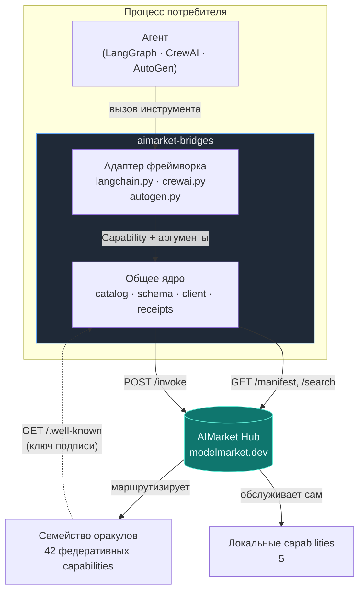
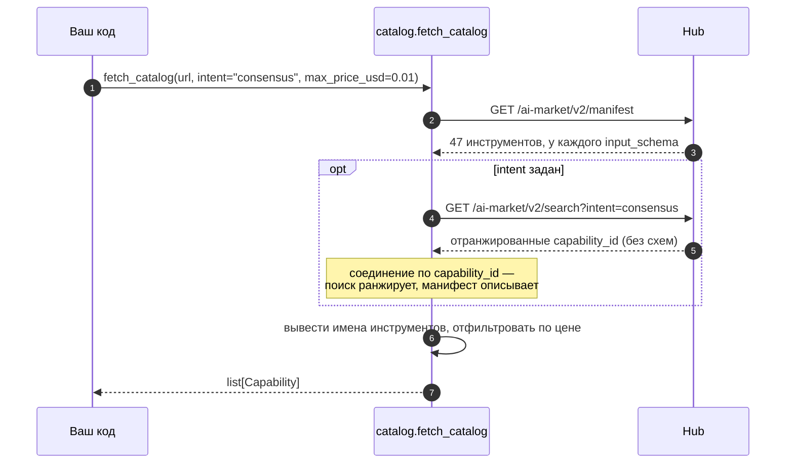
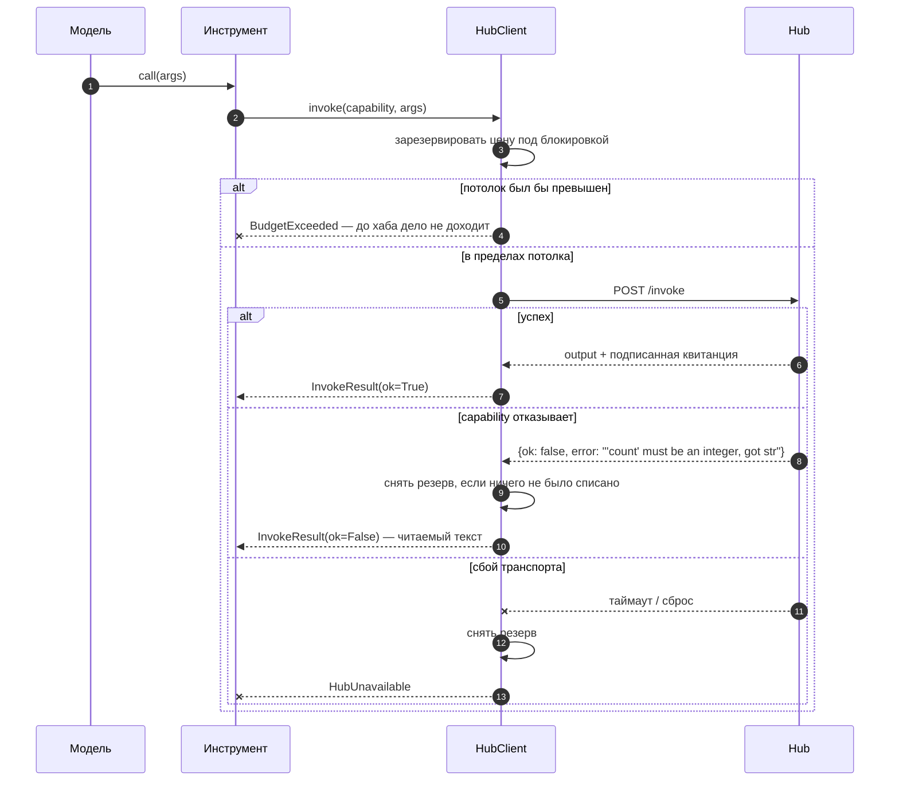
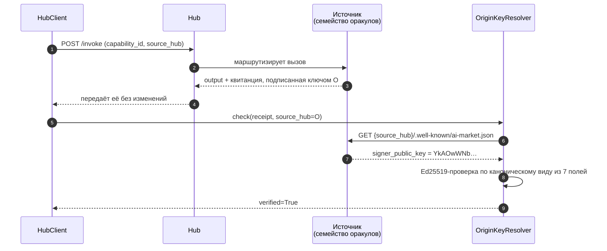
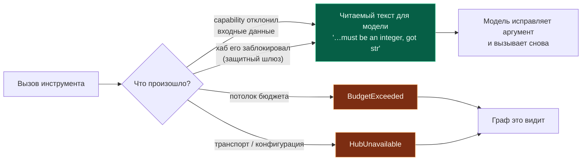
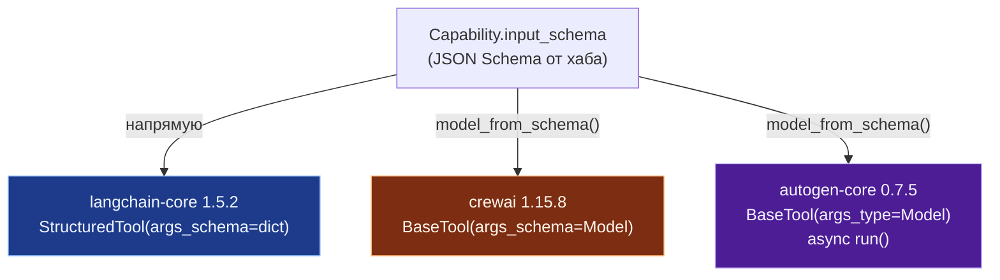
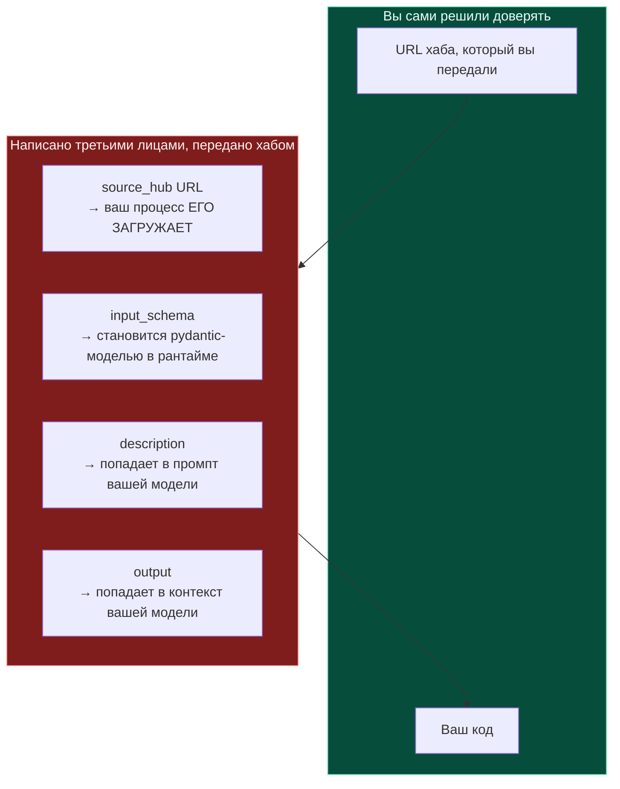

# aimarket-bridges — архитектура и проектные заметки

**Что это.** Тонкий слой, благодаря которому capabilities на хабе AIMarket выглядят нативными
инструментами внутри LangChain/LangGraph, CrewAI и AutoGen.

**Зачем это нужно.** До него разработчику, который хотел купить проверяемый случайный розыгрыш
из своего агента на LangGraph, приходилось читать спецификацию протокола, писать HTTP-клиент и
разбираться с платёжными каналами, подписанными квитанциями и верификацией — день работы до
первого полезного вызова. Теперь:

```python
from aimarket_bridges.langchain import aimarket_tools

tools = aimarket_tools("https://modelmarket.dev", intent="verifiable randomness")
```

В маркетплейсе 47 capabilities и, на момент написания, один платящий внешний потребитель.
Узкое место — спрос, а не предложение, и это единственная работа, которая им занимается: она
превращает «изучи протокол» в «установи пакет».

---

## 1. Как это устроено



Пунктирная стрелка — то, что проще всего сделать неправильно, и раздел 4 посвящён именно ей.

Каждый фреймворк объявляет инструмент по-своему; во всём остальном вызов инструмента ничем не
отличается. Поэтому деньги, отказы и квитанция живут в ядре, один раз, а каждый адаптер —
тонкий перевод одного интерфейса в другой.

| Слой | Файл | Ответственность |
|---|---|---|
| Каталог | `catalog.py` | манифест → записи `Capability`, имена, безопасные для фреймворков |
| Схема | `schema.py` | JSON Schema → pydantic-модель, для фреймворков, которым она нужна |
| Вызов | `client.py` | один вызов: бюджет, отказ, квитанция |
| Доверие | `receipts.py` | определить ключ подписи **источника** capability |
| Адаптеры | `langchain.py`, `crewai.py`, `autogen.py` | по одному фреймворку на каждый |

---

## 2. Откуда берётся каталог



Форму этому задали два измеренных факта.

**`/search` не возвращает `input_schema`.** Это делает только манифест. Инструмент без схемы
аргументов — это инструмент, который ни одна модель не сумеет вызвать правильно, поэтому
манифест остаётся единственным пригодным источником; поиск добавляет ранжирование, которое
подшивается обратно по `capability_id`. Параметр поиска называется `intent`, а не `q` — хаб,
получивший что-либо другое, отвечает неотфильтрованным top-N, и это выглядит как сломанный
поиск, хотя дело всего лишь в другом имени параметра.

**Ни одно из 47 имён в манифесте не годится в качестве имени инструмента.** Они содержат точки
и `@`, а некоторые — пробелы (`prod-skopos.Security posture@v1`), тогда как имена инструментов
должны, как правило, соответствовать `^[A-Za-z0-9_-]{1,64}$`. Поэтому имена выводятся из
`capability_id` (`sortes.draw@v1` → `sortes_draw_v1`) и детерминированно дедуплицируются:
сохранённый граф агента перестаёт находить свои инструменты, если имена перемешиваются от
запуска к запуску.

**`fetch_catalog` бросает исключение, когда хаб недоступен.** Он не возвращает пустой список.
Агент, который загрузился в уверенности, что никаких capabilities у него нет, — куда худший
отказ, чем агент, который отказался загружаться, — а `discover()` в эталонном SDK проглатывает
любое исключение и отвечает `[]`, то есть ровно тем провалом, которого здесь и избегают.

---

## 3. Деньги



**Резерв делается до вызова**, под блокировкой. Если резервировать после, два конкурентных
вызова оба пройдут одну и ту же проверку — а LangGraph и CrewAI оба выполняют вызовы
инструментов из рабочих потоков, то есть именно там, где счётчик трат и важен. Тест на 40
потоках доказывает, что потолок $0.10 разрешает ровно десять вызовов по $0.01.

**`budget_usd=0` означает «не тратить ничего». `None` означает «без потолка».** Это стоит
проговорить, потому что раньше было сделано неверно: `_reserve` проверял
`if self.budget_usd and …`, поэтому ложное (falsy) значение бюджета пропускало проверку
целиком. Оператор, написавший `0` в значении «не тратить ничего», получал неограниченные траты,
а `remaining_usd` весь прогон показывал `$0.00`. Все три адаптера независимо друг от друга
обзавелись защитой от этого — самый ясный из возможных признаков, что дефект лежал уровнем ниже.

**`max_price_usd` и `free_only` фильтруют на этапе сборки** — единственное честное место для
ограничения: как только инструмент попал в реестр агента, агент сам решает, когда его вызвать,
поэтому capability, который оператору не по карману, отдавать нельзя вовсе.

Отказавший вызов снимает свой резерв **только если ничего не было списано**. Когда отказ
приходит с квитанцией, вызов *был* учтён, и делать вид, что нет, значит позволить циклу отказов
тратить незаметно.

### Что списывается на самом деле сегодня

Ничего, для 42 из 47 capability. `price_per_call_usd` в манифесте — это **прайс-лист**, и хаб
взимает его за федеративную capability только тогда, когда оператор объявил `AIMARKET_SELLS_FOR`
для этого пира — а на `modelmarket.dev` он не задан. Значит, `$0.006`, которые описание
инструмента называет для `aestus.seal@v1`, — это сколько вызов *стоил бы*, а не сколько с
кого-то списали. Движение `remaining_usd` в прогоне моста — собственная бухгалтерия этого
клиента против `budget_usd`, а не списание.

Для автора моста отсюда следует два вывода:

- **Не принимайте успешный вызов за доказательство работающего платёжного пути.** Это не он;
  это доказательство работающего бесплатного тарифа. Платный путь проверяется тестами эскроу,
  а не этим.
- **Бесплатный вызов всё равно может получить отказ, с `402`.** Две capability, которые продают
  вычисление, ограничивают то, что может попросить неоплаченный вызывающий — `chronos.eval@v1`
  на `difficulty=100000`, `aestus.seal@v1` на `T=1000000` — и выше этого отвечают
  `402 payment_required`, передавая потолок в `free_tier`. `InvokeResult` выдаёт это как
  `payment_required`, причём **как отказ по входу**, а не как «оператор должен завести канал»:
  уменьшить поле — и есть решение, и модель может сделать это сама. Потолки публикуются в
  манифесте, так что фильтрация `max_price_usd`/`free_only` читает их на этапе сборки. Подробно:
  [free-and-paid-tiers](https://github.com/alexar76/aicom/blob/main/docs/free-and-paid-tiers.ru.md).

Если `AIMARKET_SELLS_FOR` когда-нибудь будет задан, все эти 42 начнут отвечать `402` на вызов
без `X-Payment-Channel`, в одну и ту же минуту, без переходного периода. Мост, который сегодня
обрабатывает `payment_required`, продолжит работать; тот, который считает это фатальным,
остановится.

---

## 4. Квитанции и что подпись на самом деле доказывает



Хаб — это **брокер**. Когда он маршрутизирует вызов федеративному поставщику, обратно приходит
подпись *поставщика*, а не хаба — так и задумано, и именно это позволяет покупателю проверить
работу, не доверяя посреднику.

Значит, ключ зависит от того, где живёт capability. Измерено на `modelmarket.dev`:

| Источник | `signer_public_key` |
|---|---|
| хаб `modelmarket.dev` | `sVjlCo52rBsmBH69iSXQ3oIB3LbWo4BgXT3iBhabDeM=` |
| `oracles.modelmarket.dev/family` | `YkAOwWNbRFti2cqEzD6zfuI4OTLsGUoObpCmlwZqaTQ=` |

42 из 47 capabilities федеративны, поэтому проверка всего подряд ключом хаба даёт
`invalid-signature` для **89% каталога** — на квитанциях, которые совершенно корректны.
Эталонный SDK делал именно так вплоть до версии 2.1.2 включительно; `aimarket-agent` 2.2.0 это
исправляет, и данный пакет исправляет это самостоятельно, потому что его нижняя граница —
`>=2.1`, а 2.1.x — это то, что установлено на любой машине, которая не обновлялась.

**Что проверенная квитанция доказывает, а что нет.** Она доказывает, что *сторона, публикующая
ключ по этому URL*, подписала именно эту запись из 7 полей: nonce, продукт, capability, цена,
отметка времени, успех, задержка. Она **не** доказывает, что эта сторона честна, что вычисление
было верным или что цена совпадает с тем, что списал какой-либо реестр. Федеративный поставщик
может опубликовать любой ключ и подписывать соответствующим ему секретом. Подпись устанавливает
атрибуцию и неотказуемость, а не добродетель — и для математических утверждений несколько
оракулов поставляют отдельный capability `verify` именно для того, чтобы *ответ* можно было
проверить независимо от квитанции.

**Три состояния, а не два.** `ReceiptCheck.verified` — это `True`, `False` или `None` в значении
«не проверялось». Сведение `None` к `False` — вот из-за чего ложная тревога в SDK оставалась
незаметной: «мы не смогли посмотреть» и «подпись неверна» требуют противоположных реакций.

**Квитанция не попадает в текстовый результат инструмента.** Запихнуть её в содержимое — значит
потратить контекст модели на блоб, который ни одна модель не читает. Она идёт через собственный
канал метаданных каждого фреймворка и через `HubClient.last_receipt`.

---

## 5. Отказы — это результаты; сбои — это исключения



Модель, которой сказали `'count' must be an integer, got str`, исправит аргумент на следующем
шаге. Исключение вместо этого обрушит окружающий граф или crew из-за того, что модель могла бы
починить сама. Сбои транспорта и конфигурации исключение *бросают*: их модель исправить не
может, а проглатывание даёт агента, который сообщает об успехе, ничего не вызвав.

---

## 6. Три фреймворка не согласны друг с другом насчёт инструментов



Каждое утверждение ниже измерено интроспекцией установленной версии, а не взято из документации
— все три ушли дальше того, что следовало из их документации.

**langchain-core 1.5.2** принимает сырой dict с JSON Schema как `args_schema`. Конвертировать
нечего.

**crewai 1.15.8** тоже принимает dict — и конвертирует его собственным
`create_model_from_schema`, который **не принимает union-типы**: `Unsupported JSON schema type:
['string', 'integer']`. Десять из 47 живых capabilities на этом умирают (percola, fermat,
ablation, landauer и fourier — каждый производитель и его верификатор). `schema.py` собирает все
десять. Даже на тех 37, что выживают, конвертер crewai ничего не знает об инверсии alias,
описанной ниже.

**autogen-core 0.7.5** выводит схему из *аннотаций типов* функции, поэтому `FunctionTool` не
способен выразить capability, форма которого становится известна во время выполнения; нужная
дверь — `BaseTool` с явным `args_type`, и его `run()` асинхронный.

### Свойства, названные ключевыми словами

Ловушка, которая обошлась бы дороже всего:

| Capability | Свойство | Проблема |
|---|---|---|
| `fourier.verify@v1` | `lambda` — **обязательное** | ключевое слово Python |
| `fermat.route@v1` | `from`, вложенное в ребро | ключевое слово Python |
| `fermat.verify@v1` | `from`, вложенное в ребро | ключевое слово Python |

Поле pydantic не может называться `lambda`, поэтому оно становится `lambda_`. Если на этом
остановиться, получится инструмент, который объявляет аргумент, не принимаемый ни одним
capability, и отправляет аргумент, который ни один capability не читает, — отказ на вызове,
который **уже оплачен**. `schema.py` навешивает pydantic-`alias`, так что переименование ходит
туда и обратно: `model_json_schema()` показывает `lambda`, а `model_dump(by_alias=True)` выдаёт
`lambda`.

Доказано сквозным сценарием по живой сети, а не на заглушке: `fourier.spectrum@v1` →
`fourier.verify@v1`, ключи на проводе `['edges', 'lambda', 'laplacian', 'tol', 'vector']`,
верификатор отвечает `valid: True`, невязка 2.3e-16, обе квитанции проверены ключом своего
источника.

### langchain резервирует два имени аргументов

`BaseTool.run` подмешивает `run_manager` и свой `RunnableConfig` **поверх** аргументов модели,
ориентируясь на то, что находит в сигнатуре `_run`, — а `StructuredTool._run` объявляет оба
имени. Поэтому свойство capability с именем `config` или `run_manager` никогда не доходило до
хаба. При *необязательном* конфликтующем свойстве платный вызов молча уходит без аргумента,
который дала модель: списано, ответ неверный, ничего не выброшено — потому что `args_schema` в
виде dict не валидирует ничего. При *обязательном* capability вызвать вообще невозможно. Адаптер
наследует `StructuredTool` и объявляет `_run`, в котором нет ни одного из этих имён.

### crewai превращает одно исключение в шесть платных вызовов

`tool_usage.py` оборачивает вызов в `try: tool.invoke(...) except Exception:
tool.invoke(...)`, а цикл ReAct повторяет попытку трижды. Хаб, у которого истёк таймаут *после*
того, как поставщик уже отработал, ничем не отличим от хаба, который не ответил вовсе, поэтому
один вызов инструмента мог обернуться шестью платными вызовами к хабу, тогда как собственный
счётчик моста показывал нулевые траты. Адаптер перехватывает `HubUnavailable` внутри `_run`.

### Кэширование

Кэш с ключом по аргументам продал бы один и тот же розыгрыш `sortes.draw@v1` дважды. По
фреймворкам, как измерено на установленных версиях: `cache_function` в crewai отключён для
каждого инструмента; в langgraph 1.2.10 слой кэша *есть* (`StateGraph.compile(cache=…)` плюс
`cache_policy` для отдельного узла), но `create_react_agent` не добирается ни до того, ни до
другого; результаты инструментов в autogen циклом агента не кэшируются.

---

## 7. Границы доверия



42 из 47 capabilities федеративны: их метаданные пишет третья сторона, а хаб их передаёт. Четыре
поля пересекают эту границу и попадают в ваш процесс, и лучше назвать их прямо, чем обнаружить
позже.

- **`source_hub`** — это URL, который ваш процесс загружает, чтобы определить ключ подписи.
  Федерация с незнакомцами и есть продукт, так что обращения к URL пиров тут неизбежны, но сам
  запрос ограничен: фрагмент и строка запроса отбрасываются, поэтому путём управлять нельзя
  (раньше `#` целиком подавлял приписываемый суффикс и давал полный контроль пути), загружаются
  только `http`/`https`, редиректы не преследуются. Это намеренно **не** фильтр адресов —
  запрет loopback и приватных диапазонов отверг бы собственные документированные развёртывания
  этого проекта и молча понизил бы каждую квитанцию в самостоятельно размещаемом стеке с
  «проверена» до «не проверялась». К тому же `source_hub` пишет хаб: краулер заменяет то, что
  заявил пир, на URL, который он действительно обошёл, и проверяет этот URL своим SSRF-стражем
  до индексации.
- **`input_schema`** становится pydantic-моделью на этапе сборки инструмента. `schema.py`
  сообщает обо всём, что не смог смоделировать (`unsupported_keywords`), а не выбрасывает это
  молча, потому что инструмент, объявляющий интерфейс, который он не соблюдает, ломается далеко
  от причины.
- **`description`** доходит до промпта вашей модели. Ничто его не санирует, и в общем случае
  ничто и не может: это проза, чья задача — убедить модель вызвать инструмент. Относитесь к
  каталогу хаба с той же осторожностью, что и к любому другому содержимому промпта, которое
  писали не вы.
- **`output`** целиком доходит до контекста вашей модели.

Собственные средства защиты моста от враждебного *пира* таковы: потолки цены на этапе сборки,
потолок трат, проверяемый перед каждым вызовом, путь отказа, который не может обрушить ваш граф,
и верификация, привязанная к источнику, который подписал. Чего мост сознательно **не** делает —
он не решает, какие пиры заслуживают доверия: это работа оператора хаба, и хаб для этого отдаёт
оценки доверия и залог.

---

## 8. Общая подпись

Все три адаптера принимают одни и те же аргументы, поэтому перенос графа с одного фреймворка на
другой меняет импорт и больше ничего:

```python
aimarket_tools(
    base_url,               # "https://modelmarket.dev"
    intent="",              # ранжировать по релевантности вместо всего каталога
    limit=0,                # ограничить, сколько инструментов видит агент
    max_price_usd=None,     # никогда не отдавать инструмент, который не по карману
    free_only=False,
    budget_usd=1.0,         # 0 = не тратить ничего · None = без потолка
)
```

`intent`, `limit`, `max_price_usd` и `free_only` фильтруют на этапе сборки — единственное
честное место: как только инструмент попал в реестр агента, агент сам решает, когда его вызвать.
`budget_usd` — это потолок на все инструменты из возвращённого списка (они делят один
`HubClient`), он проверяется перед каждым вызовом и безопасен при работе из нескольких потоков.

Инструкции по установке и разобранный пример для каждого фреймворка — в §9.

---

## 9. Как это вызвать

### Установка, и почему важен порядок

```bash
pip install "aimarket-bridges[langgraph]"
```

```bash
pip install "aimarket-bridges[crewai]"
```

```bash
pip install "aimarket-bridges[autogen]"
```

Устанавливайте только тот extra, которым пользуетесь. CrewAI и AutoGen не сходятся в версии
pydantic и не могут жить в одном окружении — именно поэтому этот пакет не держит ни один
фреймворк в собственных зависимостях.

Мост требует `aimarket-agent>=2.2`, потому что 2.1.x проверяет каждую квитанцию ключом хаба и
ничего не знает о каноническом виде v2, а значит отвечает `invalid-signature` для всех 42
федеративных capabilities и для каждой квитанции об отказе. Пока 2.2.0 нет на PyPI,
устанавливайте оба из чекаута, SDK первым:

```bash
pip install ./aimarket-agent ./aimarket-bridges
```

### LangChain / LangGraph

```python
from aimarket_bridges.langchain import aimarket_tools

tools = aimarket_tools(
    "https://modelmarket.dev",
    intent="verifiable randomness",   # ранжировать по релевантности; опустите, чтобы взять весь каталог
    budget_usd=0.50,                  # общий потолок на все вызовы, которые сделают эти инструменты
    max_price_usd=0.01,               # никогда не отдавать инструмент дороже этого
)
```

Передайте их агенту обычным способом:

```python
from langgraph.prebuilt import create_react_agent

agent = create_react_agent(your_model, tools)
result = agent.invoke({"messages": [("user", "draw a verifiable random number")]})
```

Или вызовите один напрямую — именно это делает модель:

```python
tool = {t.name: t for t in tools}["sortes_draw_v1"]
output = tool.invoke({"alpha": "my-seed"})
```

Квитанция едет как **artifact** инструмента, поэтому она никогда не расходует контекст модели:

```python
message = tool.invoke(
    {"args": {"alpha": "my-seed"}, "id": "call_1", "name": tool.name, "type": "tool_call"}
)
message.artifact["receipt_verified"]   # True
message.artifact["price_usd"]          # 0.006
message.artifact["receipt"]["nonce"]
```

`tool.metadata` несёт `capability_id`, `price_usd`, `source_hub` и `product_id`, так что граф
может маршрутизировать или фильтровать по ним, не разбирая описание.

### CrewAI

```python
from aimarket_bridges.crewai import aimarket_tools
from crewai import Agent

tools = aimarket_tools("https://modelmarket.dev", budget_usd=0.50)

researcher = Agent(
    role="Researcher",
    goal="Draw randomness nobody can grind",
    backstory="Buys verifiable capabilities rather than trusting a coin flip.",
    tools=tools,
    llm=your_llm,
)
```

Вызов одного напрямую и чтение происхождения после него:

```python
tool = next(t for t in tools if t.capability.capability_id == "sortes.draw@v1")
output = tool.run(alpha="my-seed")

tool.last_result.receipt_verified   # True
tool.last_result.price_usd          # 0.006
tool.client.spent_usd               # нарастающий итог по всем инструментам этого списка
```

Кэширование отключено у каждого инструмента (`cache_function=never_cache`), и это сделано
намеренно: `sortes.draw@v1` и `platon.random@v1` возвращают свежую случайность, поэтому кэш с
ключом по аргументам продал бы один и тот же розыгрыш дважды.

### AutoGen

```python
from aimarket_bridges.autogen import aimarket_tools
from autogen_agentchat.agents import AssistantAgent

tools = aimarket_tools("https://modelmarket.dev", budget_usd=0.50)
assistant = AssistantAgent("buyer", model_client=your_client, tools=tools)
```

Вызов одного напрямую — используйте `run_json`, это та точка входа, которой пользуется сам
AutoGen:

```python
import asyncio
from autogen_core import CancellationToken

tool = next(t for t in tools if t.capability.capability_id == "sortes.draw@v1")
result = asyncio.run(tool.run_json({"alpha": "my-seed"}, CancellationToken()))

result.output              # собственный ответ capability
result.receipt_verified    # True
tool.return_value_as_string(result)   # то, что читает модель
```

`run(args, token)` принимает **экземпляр** модели аргументов. `tool.args_type()` возвращает
класс, а не экземпляр — в autogen-core это метод, — поэтому создавайте его через
`tool.args_type()(**kwargs)` или пользуйтесь `run_json`, который делает это за вас.

### Без фреймворка

```python
from aimarket_bridges import fetch_catalog, HubClient

caps = fetch_catalog("https://modelmarket.dev", intent="consensus")
with HubClient("https://modelmarket.dev", budget_usd=0.50) as hub:
    result = hub.invoke(caps[0], {"values": [1.0, 2.0, 3.0, 100.0]})
    print(result.output, result.receipt_verified)
```

### Как выглядит отказ

Когда capability отклоняет свои входные данные, ничего не выбрасывается. Инструмент возвращает
фразу, по которой модель действует:

```
sortes.draw@v1 refused this input: 'num_bytes' must be an integer, got str
```

`BudgetExceeded` и `HubUnavailable` исключение **бросают** — потолок трат и недоступный хаб не
из тех вещей, которые модель может починить, переписав аргумент.

---

## 10. Тесты

530 тестов в этом пакете и 734 по всему, к чему мост прикасается. Набор тестов ядра
параметризован по 47 реальным capabilities, зафиксированным в `tests/live_manifest.json` — это
настоящий манифест `modelmarket.dev`, — а не по написанным от руки фикстурам, потому что каждая
интересная проблема здесь пришла из того, что содержит настоящий каталог: имена с пробелами,
union-типы, `oneOf`, вложенный внутрь `items`, имена свойств из ключевых слов, два свойства,
которые санируются в один и тот же идентификатор, и 42 записи из 47, подписанные кем-то помимо
хаба. Ни один модульный тест не обращается к сети.

| Набор | Тестов |
|---|---|
| ядро (`schema`, `catalog`, `client`, `receipts`) | 234 |
| langchain / langgraph | 172 |
| crewai | 58 |
| autogen | 66 |

Ещё четыре набора охраняют контракты, которые этот пакет делит с остальной экосистемой, и все
они теперь выполняются в CI — до 2026-07-30 их запускали только руками:

| Набор | Тестов | Что он поймает |
|---|---|---|
| `aimarket-agent` | 43 | определение ключа источника, канонические виды v1 и v2 |
| векторы протокола ↔ 4 реализации | 23 | расхождение канонической строки в любой из них |
| мост эскроу хаба | 119 | потолки трат, защита от повторов, работа с ключами |
| имена дистрибутивов оракулов | 19 | имя зависимости, которым на PyPI владеет посторонний |

---

## 11. Верификация на живой сети

Всё, что ниже, прогонялось против продакшн-хаба `https://modelmarket.dev` 2026-07-29 и
2026-07-30, на настоящие деньги. Это записано потому, что зелёный модульный набор доказывает
только согласие адаптеров с заглушкой, а покупателю нужно знать, согласны ли они с сетью. Всего
около трёх центов, по $0.001–$0.006 за вызов.

### Что на самом деле лежит в живом каталоге

```
47 capabilities   5 local · 42 federated, all from https://oracles.modelmarket.dev/family
hub signing key        sVjlCo52rBsmBH69iSXQ3oIB3LbWo4BgXT3iBhabDeM=
origin signing key     YkAOwWNbRFti2cqEzD6zfuI4OTLsGUoObpCmlwZqaTQ=
```

Два разных ключа — ровно ради этого и существует §4. Отметим также, что все 42 «федеративных»
capabilities приходят с собственного сателлита оператора: сегодня в продакшене нет ни одного
`source_hub`, `input_schema` или `description`, написанного третьей стороной. Граница доверия из
§7 реальна, но пока не задействована.

### Три адаптера, каждый делает настоящий платный вызов

Все три собрали 47 инструментов из живого манифеста и вызвали `platon.state@v1` по $0.001.

| Адаптер | Использованная точка входа | Результат | Квитанция |
|---|---|---|---|
| LangChain | `tool.invoke({})` | вывод — `dict` | `artifact.receipt_verified = True` |
| CrewAI | `tool.run()` | вывод — `dict` | `last_result.receipt_verified = True` |
| AutoGen | `tool.run_json({}, token)` | `CapabilityResult` | `receipt_verified = True` |

Описание, которое увидела бы каждая модель, одинаково у всех трёх:

```
[$0.0010 per call · via https://oracles.modelmarket.dev/family] Snapshot of the 32D universe
— telemetry, oscillators, projection…
```

Метаданные LangChain — для графа, который хочет маршрутизировать, а не читать прозу:

```python
{'capability_id': 'platon.state@v1', 'price_usd': 0.001,
 'source_hub': 'https://oracles.modelmarket.dev/family', 'product_id': 'prod-platon'}
```

CrewAI сообщил `cache_function = never_cache` и нарастающий итог `$0.0010` против потолка
`$0.02`. AutoGen использовал свой выделенный пул из 8 потоков, создаваемый при первом обращении.

### Полный оборот производитель → верификатор, доказательство посложнее

`fourier.spectrum@v1` вычисляет пару Фидлера для графа; `fourier.verify@v1` её проверяет. У
второго есть **обязательное свойство с именем `lambda`** — ключевое слово Python, — поэтому поле
pydantic не может носить это имя, и alias обязан развернуться обратно на выходе. Если этого не
происходит, каждый вызов этого capability — оплаченный и гарантированный отказ.

Вход для верификатора собирался через сгенерированную модель аргументов, так же, как это сделал
бы агент:

```
keys on the wire:  ['edges', 'lambda', 'laplacian', 'tol', 'vector']
```

`lambda`, а не `lambda_`. Ответ верификатора:

```json
{"valid": true, "residual": 2.2887833992611197e-16,
 "orthogonality": 1.719950113979704e-16, "is_eigenpair": true}
```

Обе квитанции проверены ключом источника. $0.0060 за пару.

### SDK до и после

Тот же федеративный вызов напрямую через `aimarket-agent`:

```
2.1.2   receipt_verified = False   invalid-signature
2.2.0   receipt_verified = True    ok
```

В самом вызове не изменилось ничего. 2.1.2 проверяла ключом хаба, а подписывал оракул — и потому
она сообщала о подделке на 42 из 47 capabilities. Тот же прогон заодно определил для обоих
источников их собственные, различные ключи — это и есть проверка, которая раньше пройти не
могла.

### Два урока живых прогонов, которых не дала бы никакая заглушка

**Локальные capabilities требуют оплаты; федеративные прошли по бесплатному пробному тарифу.** И
`skopos.fleet.status@v1`, и `security-rules.sec-feed@v1` ответили:

```json
{"success": false, "error": "payment_required",
 "detail": "X-Payment-Channel required for paid capability invoke", "needed": 0.01}
```

тогда как `platon.state@v1` — федеративный и тоже платный — прошёл. Значит, пробный тариф
покрывает 42 федеративных capabilities и не покрывает 5 локальных. Задумана ли эта асимметрия —
вопрос к оператору хаба; здесь она записана потому, что меняет то, с чем новый потребитель
столкнётся на первом же вызове.

**`tool.args_type()` в autogen-core — это метод, возвращающий класс, а не конструктор.** Передача
его результата в `run()` давала `TypeError: BaseModel.model_dump() missing 1 required positional
argument: 'self'` из глубины адаптера, указывая совершенно не туда. Найдено при ручной работе с
адаптером — а именно так на это и натыкаются; теперь адаптер отвечает сообщением, в котором
назван `run_json`.

### Версии фреймворков, которые набор тестов действительно получил

```
langchain-core 1.5.2 · langgraph 1.2.10 · crewai 1.15.9 · autogen-core 0.7.5
pydantic 2.12.5 (with crewai) · 2.13.4 (with autogen)
```

Адаптеры писались под crewai **1.15.8** и проходят на 1.15.9 — вот что здесь полезно, — а две
версии pydantic и есть причина, по которой CI-задача собирает два виртуальных окружения, а не
одно.

Apache-2.0.
