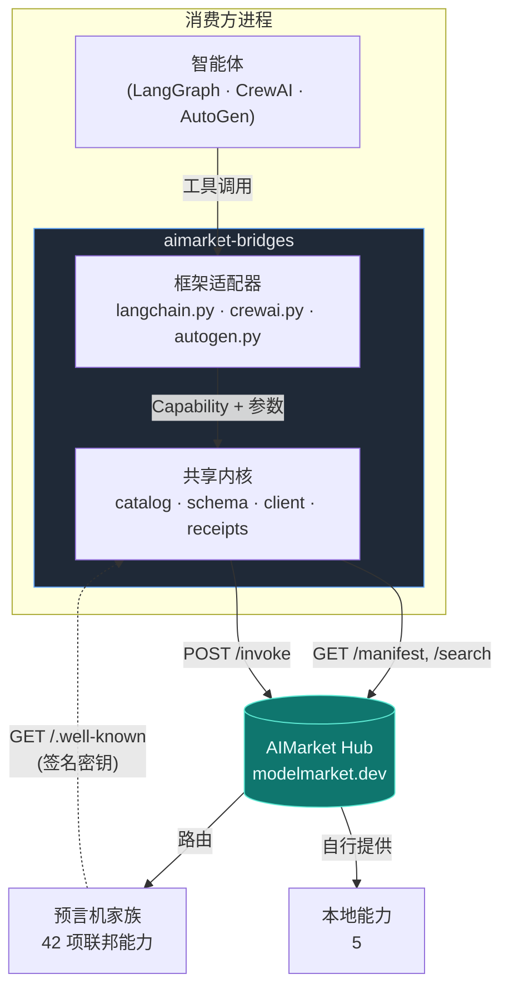
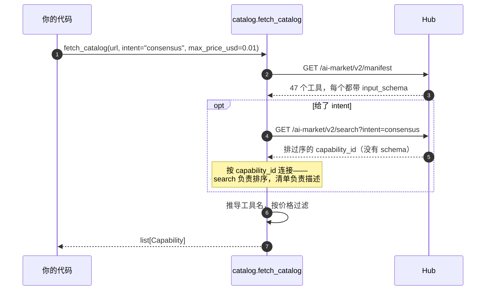
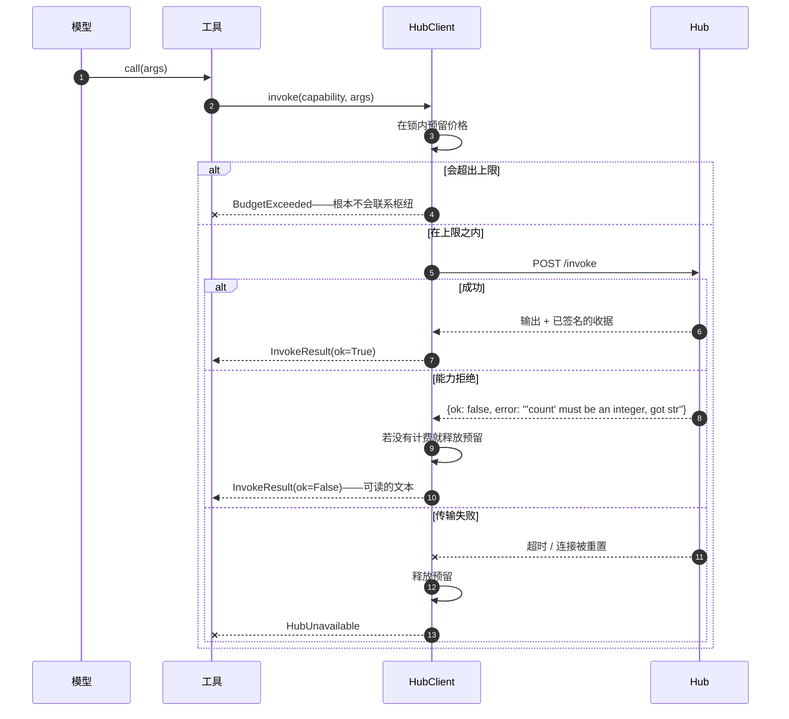
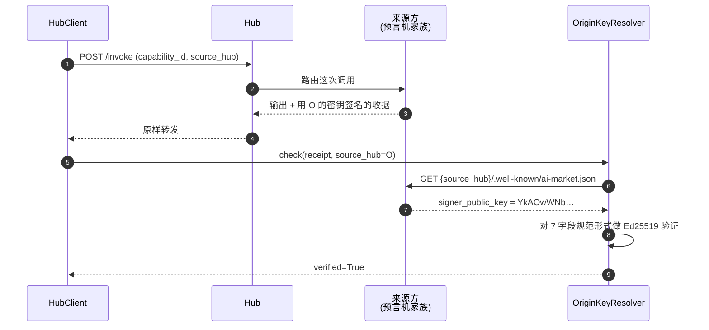
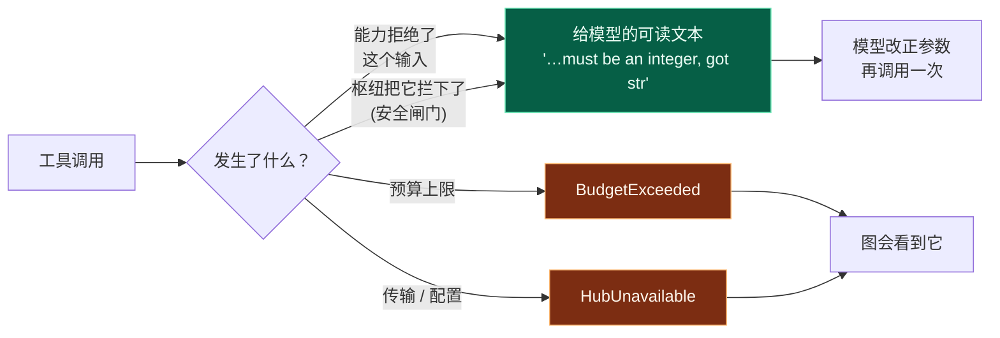
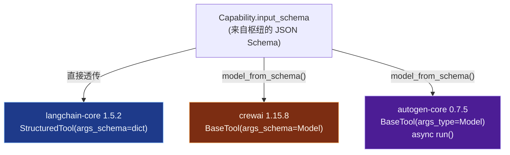
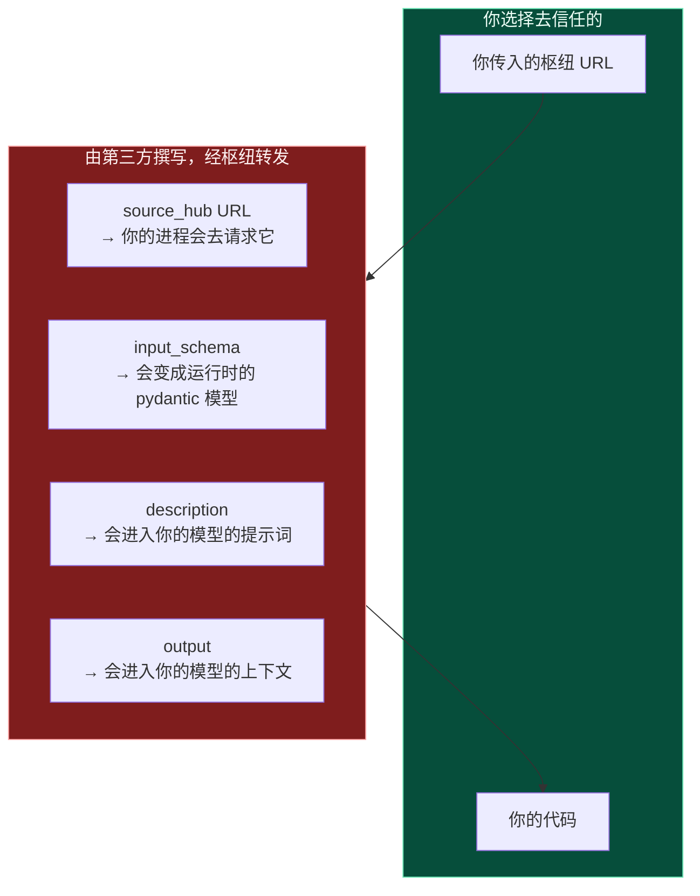

# aimarket-bridges — 架构与设计说明

**它是什么。** 一个很薄的层，让 AIMarket 枢纽（Hub）上的各项能力，在 LangChain/LangGraph、CrewAI
和 AutoGen 里表现为原生工具。

**它为何存在。** 在它出现之前，一个想从自己的 LangGraph 智能体里买一次可验证随机抽取的开发者，
得先读协议规范、写一个 HTTP 客户端，再自己处理支付通道、签名收据和验证——在第一次有用的调用之前，
先花掉一天。现在：

```python
from aimarket_bridges.langchain import aimarket_tools

tools = aimarket_tools("https://modelmarket.dev", intent="verifiable randomness")
```

这个交易市场有 47 项能力，而在撰写本文时，只有一个付费的外部消费方。瓶颈在需求侧，不在供给侧，
而这是唯一针对该瓶颈的工作：它把“学一套协议”变成“装一个包”。

---

## 1. 它长什么样



那条虚线箭头是最容易做错的一环，第 4 节讲的就是它。

每个框架声明工具的方式都不一样；除此之外，一次工具调用没有任何区别。所以钱、拒绝和收据都放在内核里，
只实现一次，而每个适配器只是把一个接口薄薄地翻译成另一个接口。

| 层 | 文件 | 职责 |
|---|---|---|
| 目录 | `catalog.py` | 清单 → `Capability` 记录、框架可安全使用的名称 |
| 模式 | `schema.py` | JSON Schema → pydantic 模型，供那些非要一个模型的框架使用 |
| 调用 | `client.py` | 一次调用：预算、拒绝、收据 |
| 信任 | `receipts.py` | 解析一项能力的**来源方**的签名密钥 |
| 适配器 | `langchain.py`、`crewai.py`、`autogen.py` | 每个文件对应一个框架 |

---

## 2. 目录从哪里来



有两个实测事实塑造了这个设计。

**`/search` 不返回 `input_schema`。** 只有清单（manifest）会返回。一个没有参数 schema 的工具，
任何模型都无法正确调用，所以清单是唯一可用的来源；search 贡献的是排序，再按 `capability_id`
连接回去。搜索参数叫 `intent`，不叫 `q`——给枢纽传别的名字，它会回一个未经过滤的 top-N，
看起来像是搜索坏了，其实只是参数名不对。

**清单里那 47 个名称，没有一个能直接当工具名用。** 它们含有点号和 `@`，还有几个含空格
（`prod-skopos.Security posture@v1`），而工具名一般必须匹配 `^[A-Za-z0-9_-]{1,64}$`。所以名称是从
`capability_id` 推导出来的（`sortes.draw@v1` → `sortes_draw_v1`），并以确定性的方式去重：
如果名称在两次运行之间乱了序，一个已保存的智能体图就再也匹配不上自己的工具。

**枢纽不可达时，`fetch_catalog` 会抛异常。** 它不会返回空列表。一个启动起来、却以为自己没有任何能力的
智能体，比一个拒绝启动的智能体要糟糕得多——而参考 SDK 的 `discover()` 会吞掉所有异常并返回 `[]`，
那正是这里要避开的失败。

---

## 3. 钱



**预留发生在调用之前**，而且在锁内。事后再预留，会让两个并发调用都通过同一次检查——而 LangGraph
和 CrewAI 都在工作线程里跑工具调用，那恰恰是花销计数器最要紧的时刻。一个 40 线程的测试证明：
$0.10 的上限恰好允许十次 $0.01 的调用。

**`budget_usd=0` 表示什么都不花。`None` 表示没有上限。** 这件事值得专门写出来，因为它曾经是错的：
`_reserve` 里判断的是 `if self.budget_usd and …`，于是一个假值预算会把整个检查完全跳过。运维人员写下
`0` 想表达“什么都不花”，得到的却是无上限的花销，而 `remaining_usd` 在整个运行期间一直报 `$0.00`。
三个适配器都各自长出了一层针对它的防护，而这是最明确不过的信号：缺陷其实在下面一层。

**`max_price_usd` 和 `free_only` 在构建时过滤**，那是放这种限制唯一诚实的位置：一旦某个工具进了
智能体的工具表，什么时候调用就由智能体自己决定，所以一项运维人员付不起的能力，根本就不该交给它。

一次被拒绝的调用，**只有在没有计费的情况下**才会释放它的预留。当拒绝是带着收据回来的，这次调用
*确实*被计量了，假装没有，就会让一连串拒绝在看不见的地方把钱花掉。

### 今天实际收费的是什么

47 项能力中有 42 项什么都不收。清单里的 `price_per_call_usd` 是**标价**，只有当运营者为该对端
声明了 `AIMARKET_SELLS_FOR` 时，Hub 才会对联邦能力收取它 —— 而 `modelmarket.dev` 上并未设置。
所以工具描述为 `aestus.seal@v1` 标出的 `$0.006`，是这次调用**本会**花多少，而不是从谁的余额里
扣走了多少。桥在运行中 `remaining_usd` 的变化，是这个客户端针对 `budget_usd` 的自有记账，不是
扣款。

对桥的作者来说，由此有两点：

- **不要把一次成功调用当成支付链路可用的证明。** 它不是；它证明的是免费层级可用。付费链路由
  托管（escrow）测试来检验，不是由这里检验。
- **免费调用同样可能被拒，返回 `402`。** 售卖计算的那两项能力会限制未付费调用者能索取的量 ——
  `chronos.eval@v1` 限于 `difficulty=100000`，`aestus.seal@v1` 限于 `T=1000000` —— 超过则返回
  `402 payment_required`，并在 `free_tier` 中带上上限。`InvokeResult` 会把它呈现为
  `payment_required`，并且明确地**作为针对输入的拒绝**，而不是「运营者需要充值通道」：把该字段
  调小就是解法，模型自己就能做到。上限发布在清单中，因此 `max_price_usd`/`free_only` 过滤在
  构建期就能读到它们。详见 [free-and-paid-tiers](https://github.com/alexar76/aicom/blob/main/docs/free-and-paid-tiers.zh.md)。

如果将来设置了 `AIMARKET_SELLS_FOR`，这 42 项会在同一分钟内、没有宽限期地，全部对缺少
`X-Payment-Channel` 的调用返回 `402`。今天就处理 `payment_required` 的桥会继续工作；把它当作
致命错误的桥会停下来。

---

## 4. 收据，以及一个签名到底证明了什么



枢纽是一个**中间商**。当它把一次 invoke 路由给一个联邦提供方时，回来的东西带的是*提供方的*签名，
不是枢纽的——这是有意的设计，也正是它让买方能在不信任中间人的前提下检查工作成果。

所以用哪把密钥，取决于这项能力住在哪里。在 `modelmarket.dev` 上实测：

| 来源方 | `signer_public_key` |
|---|---|
| 枢纽 `modelmarket.dev` | `sVjlCo52rBsmBH69iSXQ3oIB3LbWo4BgXT3iBhabDeM=` |
| `oracles.modelmarket.dev/family` | `YkAOwWNbRFti2cqEzD6zfuI4OTLsGUoObpCmlwZqaTQ=` |

47 项能力里有 42 项是联邦的，所以拿枢纽的密钥去验证一切，会对**目录里的 89%** 报
`invalid-signature`——而那些收据完全有效。参考 SDK 直到 2.1.2（含）都正是这么干的；`aimarket-agent`
2.2.0 修好了它，而本包又独立地修了一遍，因为它的下限是 `>=2.1`，而任何没有升级的机器上装的都是
2.1.x。

**一张通过验证的收据证明了什么，又没有证明什么。** 它证明的是：*在那个 URL 上发布密钥的那一方*，
签署了这一条确切的 7 字段记录：nonce、product、capability、price、timestamp、success、latency。
它**不**证明那一方是诚实的，不证明计算是正确的，也不证明价格与任何账本实际收取的数额相符。
一个联邦提供方可以发布任意密钥，再用对应的私钥签名。签名确立的是归属与不可否认性，不是品行——
而对于数学层面的断言，好几个预言机额外提供了一项单独的 `verify` 能力，正是为了让*答案*本身可以
脱离收据被独立检验。

**是三种状态，不是两种。** `ReceiptCheck.verified` 的取值是 `True`、`False`，或者表示“未检查”的
`None`。把 `None` 折叠成 `False`，正是那个 SDK 的误报一直没被看见的原因：“我们没能去看”和
“签名是错的”，需要的是相反的反应。

**收据不会进入工具的文本结果。** 把它塞进内容里，等于把模型的上下文令牌花在一团没有任何模型会去读
的数据上。它走的是每个框架自己的元数据通道，以及 `HubClient.last_receipt`。

---

## 5. 拒绝是结果；失败是异常



一个被告知 `'count' must be an integer, got str` 的模型，会在下一轮把参数改对。改成抛异常，
就会为了一件模型自己本来能修好的事情，把外层的图或者 crew 整个中断掉。传输和配置层面的失败*确实*
会抛异常：那些是模型修不了的，而吞掉它们，得到的是一个什么都没调用却报告成功的智能体。

---

## 6. 三个框架对工具的看法并不一致



下面每一条陈述，都是针对已安装版本做内省实测得到的，不是从文档里抄来的——三个框架都已经跑到
文档所暗示的位置之外了。

**langchain-core 1.5.2** 接受一个原始 JSON Schema 字典作为 `args_schema`。不需要任何转换。

**crewai 1.15.8** 也接受字典——但它会用自己的 `create_model_from_schema` 去转换，而那个转换器
**不接受联合类型**：`Unsupported JSON schema type: ['string', 'integer']`。47 项线上能力里有十项
就死在这儿（percola、fermat、ablation、landauer 和 fourier，每个生产者加上它的验证器）。`schema.py`
这十项全都能构建出来。即便是活下来的那 37 项，crewai 的转换器也完全不知道下面要讲的别名反转。

**autogen-core 0.7.5** 是从函数的*类型注解*推导 schema 的，所以 `FunctionTool` 无法表达一项形状在
运行时才到手的能力；带显式 `args_type` 的 `BaseTool` 才是对的那扇门，而它的 `run()` 是异步的。

### 用关键字命名的属性

代价可能最高的那个陷阱：

| 能力 | 属性 | 问题 |
|---|---|---|
| `fourier.verify@v1` | `lambda`——**必填** | 一个 Python 关键字 |
| `fermat.route@v1` | `from`，嵌在一条边里 | 一个 Python 关键字 |
| `fermat.verify@v1` | `from`，嵌在一条边里 | 一个 Python 关键字 |

一个 pydantic 字段不能叫 `lambda`，于是它变成了 `lambda_`。到此为止的话，得到的工具会对外宣告一个
没有能力接受的参数，同时发出一个没有能力会去读的参数——也就是在一次**已经计费**的调用上换回一个拒绝。
`schema.py` 挂上了一个 pydantic 的 `alias`，让这次改写可以往返还原：`model_json_schema()` 显示的是
`lambda`，`model_dump(by_alias=True)` 发出的也是 `lambda`。

这是在真实网络上端到端验证过的，不是在桩里：`fourier.spectrum@v1` → `fourier.verify@v1`，
线上实际的键是 `['edges', 'lambda', 'laplacian', 'tol', 'vector']`，验证器回答 `valid: True`，
残差 2.3e-16，两张收据都用各自来源方的密钥验证通过。

### langchain 占用了两个参数名

`BaseTool.run` 会把 `run_manager` 和它的 `RunnableConfig` **覆盖**到模型给出的参数之上，依据的是
它在 `_run` 签名上找到的东西——而 `StructuredTool._run` 把这两个都声明了。因此，一项能力里名为
`config` 或 `run_manager` 的属性，从来就没到过枢纽。如果撞名的属性是*可选的*，那次付费调用会静默地
少带一个模型明明给了的参数就发出去：计了费、答案是错的、什么异常都没抛，因为字典形式的
`args_schema` 什么都不校验。如果撞名的属性是*必填的*，这项能力就根本没法调用。适配器的做法是继承
`StructuredTool`，并写一个两个名字都不声明的 `_run`。

### crewai 会把一个异常变成六次付费调用

`tool_usage.py` 把调用包在 `try: tool.invoke(...) except Exception: tool.invoke(...)` 里，
而 ReAct 循环还会重试三次。一个在提供方*已经跑完之后*才超时的枢纽，和一个从来没应答的枢纽，
是分辨不出来的，所以单独一次工具调用可以在枢纽那边计费六次，而桥接层自己的计数器显示一分钱都没花。
适配器在 `_run` 内部捕获 `HubUnavailable`。

### 缓存

一个以参数为键的缓存，会把同一次 `sortes.draw@v1` 抽取卖两遍。按框架分别来看，都是在已安装版本上
实测的：crewai 的 `cache_function` 对每个工具都是关闭的；langgraph 1.2.10 *确实*有一层缓存
（`StateGraph.compile(cache=…)` 加上按节点的 `cache_policy`），但 `create_react_agent` 两个都碰不到；
autogen 的工具结果不会被智能体循环缓存。

---

## 7. 信任边界



47 项能力里有 42 项是联邦的：元数据由第三方撰写，枢纽只负责转发。有四个字段会越过那条边界进入
你的进程，把它们明明白白点出来，好过日后自己撞上。

- **`source_hub`** 是你的进程为了解析签名密钥而去请求的一个 URL。与陌生人联邦本来就是这个产品，
  所以请求对端 URL 是内在的，但这个请求是受约束的：片段和查询串会被丢弃，因此路径无法被操纵
  （以前一个 `#` 就能把追加的后缀整个吞掉，从而获得对路径的精确控制），只请求 `http`/`https`，
  并且不跟随重定向。它有意**不是**地址过滤器——拒绝回环地址和私有网段会连本项目自己
  在文档里写明的部署一起拒掉，并把自托管环境中的每一张收据从“已验证”悄悄降级为“未验证”。
  另外 `source_hub` 由 Hub 写入：爬虫会用它实际抓取到的 URL 覆盖对端声称的值，
  并在索引之前先用自己的 SSRF 守卫检查这个 URL。
- **`input_schema`** 会在构建工具时变成一个 pydantic 模型。凡是它建不出模型的东西，`schema.py`
  都会报出来（`unsupported_keywords`），而不是默默丢掉，因为一个宣告了自己并不遵守的接口的工具，
  出问题的地方离病因很远。
- **`description`** 会到达你的模型的提示词。没有任何东西会对它做净化，一般来说也没法做：它就是一段
  以说服模型调用该工具为目的的文字。对待一个枢纽的目录，请像对待任何其他不是你自己写的提示词内容
  一样小心。
- **`output`** 会整块进入你的模型的上下文。

桥接层自己针对恶意*对端*的防护是：构建时的价格上限、每次调用之前强制执行的花销上限、一条不会中断
你的图的拒绝路径，以及绑定到实际签名的来源方的验证。它有意**不**做的事情是判断哪些对端值得信任——
那是枢纽运营方的工作，枢纽为此暴露了信任分和保证金。

---

## 8. 共享的那套函数签名

三个适配器接受的参数完全相同，所以把一张图从一个框架搬到另一个框架，要改的只有 import，别无其他：

```python
aimarket_tools(
    base_url,               # "https://modelmarket.dev"
    intent="",              # 按相关性排序，而不是取整个目录
    limit=0,                # 限制智能体能看到多少个工具
    max_price_usd=None,     # 绝不交出付不起的工具
    free_only=False,
    budget_usd=1.0,         # 0 = 不花费 · None = 无上限
)
```

`intent`、`limit`、`max_price_usd` 和 `free_only` 都在构建时过滤，那是唯一诚实的位置：一旦某个
工具进了智能体的工具表，什么时候调用就由智能体自己决定。`budget_usd` 是横跨返回列表里每一个工具的
上限——它们共用同一个 `HubClient`——在每次调用之前强制执行，并且跨线程安全。

安装说明和每个框架的完整示例见第 9 节。

---

## 9. 怎么调用它

### 安装，以及为什么顺序有讲究

```bash
pip install "aimarket-bridges[langgraph]"
```

```bash
pip install "aimarket-bridges[crewai]"
```

```bash
pip install "aimarket-bridges[autogen]"
```

只装你要用的那一个 extra。CrewAI 和 AutoGen 在 pydantic 版本上谈不到一起，没法共处同一个环境——
正因如此，本包自己的依赖里不放任何框架。

桥接层要求 `aimarket-agent>=2.2`，因为 2.1.x 会拿枢纽的密钥去验证每一张收据，而且完全不知道 v2
规范形式，于是它对全部 42 项联邦能力、以及每一张拒绝收据，都回答 `invalid-signature`。在 2.2.0
上到 PyPI 之前，请从检出的代码里把两个都装上，SDK 在前：

```bash
pip install ./aimarket-agent ./aimarket-bridges
```

### LangChain / LangGraph

```python
from aimarket_bridges.langchain import aimarket_tools

tools = aimarket_tools(
    "https://modelmarket.dev",
    intent="verifiable randomness",   # 按相关性排序；省略则取整个目录
    budget_usd=0.50,                  # 这些工具的每一次调用共享的上限
    max_price_usd=0.01,               # 绝不交出比这更贵的工具
)
```

按通常的方式把它们交给一个智能体：

```python
from langgraph.prebuilt import create_react_agent

agent = create_react_agent(your_model, tools)
result = agent.invoke({"messages": [("user", "draw a verifiable random number")]})
```

或者直接调用其中一个，模型做的也就是这件事：

```python
tool = {t.name: t for t in tools}["sortes_draw_v1"]
output = tool.invoke({"alpha": "my-seed"})
```

收据是作为工具的 **artifact** 传递的，所以它从不消耗模型的上下文：

```python
message = tool.invoke(
    {"args": {"alpha": "my-seed"}, "id": "call_1", "name": tool.name, "type": "tool_call"}
)
message.artifact["receipt_verified"]   # True
message.artifact["price_usd"]          # 0.006
message.artifact["receipt"]["nonce"]
```

`tool.metadata` 里带着 `capability_id`、`price_usd`、`source_hub` 和 `product_id`，所以一张图
可以按它们路由或过滤，不必去解析描述文字。

### CrewAI

```python
from aimarket_bridges.crewai import aimarket_tools
from crewai import Agent

tools = aimarket_tools("https://modelmarket.dev", budget_usd=0.50)

researcher = Agent(
    role="Researcher",
    goal="Draw randomness nobody can grind",
    backstory="Buys verifiable capabilities rather than trusting a coin flip.",
    tools=tools,
    llm=your_llm,
)
```

直接调用其中一个，并在之后读取它的来源信息：

```python
tool = next(t for t in tools if t.capability.capability_id == "sortes.draw@v1")
output = tool.run(alpha="my-seed")

tool.last_result.receipt_verified   # True
tool.last_result.price_usd          # 0.006
tool.client.spent_usd               # 这个列表里所有工具的累计花销
```

每个工具上的缓存都是关闭的（`cache_function=never_cache`），而这是有意的：`sortes.draw@v1` 和
`platon.random@v1` 返回的是新鲜的随机性，所以一个以参数为键的缓存会把同一次抽取卖两遍。

### AutoGen

```python
from aimarket_bridges.autogen import aimarket_tools
from autogen_agentchat.agents import AssistantAgent

tools = aimarket_tools("https://modelmarket.dev", budget_usd=0.50)
assistant = AssistantAgent("buyer", model_client=your_client, tools=tools)
```

直接调用其中一个——用 `run_json`，那正是 AutoGen 自己用的入口：

```python
import asyncio
from autogen_core import CancellationToken

tool = next(t for t in tools if t.capability.capability_id == "sortes.draw@v1")
result = asyncio.run(tool.run_json({"alpha": "my-seed"}, CancellationToken()))

result.output              # 能力自己给出的答案
result.receipt_verified    # True
tool.return_value_as_string(result)   # 模型读到的东西
```

`run(args, token)` 接受的是参数模型的一个**实例**。`tool.args_type()` 返回的是类，不是实例——
在 autogen-core 里它是一个方法——所以要用 `tool.args_type()(**kwargs)` 把它构造出来，或者直接用
`run_json`，那件事它替你做了。

### 不用框架

```python
from aimarket_bridges import fetch_catalog, HubClient

caps = fetch_catalog("https://modelmarket.dev", intent="consensus")
with HubClient("https://modelmarket.dev", budget_usd=0.50) as hub:
    result = hub.invoke(caps[0], {"values": [1.0, 2.0, 3.0, 100.0]})
    print(result.output, result.receipt_verified)
```

### 一次拒绝长什么样

当一项能力拒绝它的输入时，什么异常都不会抛。工具返回的是一句模型可以照着办的话：

```
sortes.draw@v1 refused this input: 'num_bytes' must be an integer, got str
```

`BudgetExceeded` 和 `HubUnavailable` **确实**会抛异常——花销上限和一个不可达的枢纽，都不是模型
靠改写一个参数就能修好的事。

---

## 10. 测试

本包里有 530 个测试，而桥接层所触及的一切加起来是 734 个。内核那套测试是在
`tests/live_manifest.json` 里记录的 47 项真实能力上参数化的——那是 `modelmarket.dev` 的真实
清单——而不是在手写的测试夹具上，因为这里每一个有意思的问题都来自真实目录里实际有的东西：
带空格的名称、联合类型、嵌在 `items` 里的 `oneOf`、用关键字命名的属性、两个净化之后落到同一个
标识符上的属性，以及 47 条里有 42 条是由枢纽之外的另一方签名的。没有任何单元测试碰网络。

| 套件 | 测试数 |
|---|---|
| 内核（`schema`、`catalog`、`client`、`receipts`） | 234 |
| langchain / langgraph | 172 |
| crewai | 58 |
| autogen | 66 |

另有四套测试守着本包与生态其余部分共享的契约，现在它们全都在 CI 里跑——在 2026-07-30 之前，
它们只被手工执行过：

| 套件 | 测试数 | 它能抓住什么 |
|---|---|---|
| `aimarket-agent` | 43 | 来源方密钥的解析、v1 和 v2 两套规范形式 |
| 协议向量 ↔ 4 个实现 | 23 | 其中任何一个实现里规范字符串发生漂移 |
| 枢纽的托管（escrow）桥接 | 119 | 花销上限、重放守卫、密钥处理 |
| 预言机发行包名称 | 19 | 一个在 PyPI 上属于陌生人的依赖名 |

---

## 11. 线上验证

下面的一切都是在 2026-07-29 和 2026-07-30 针对生产环境的枢纽 `https://modelmarket.dev` 跑出来的，
花的是真钱。之所以记录下来，是因为一套通过的单元测试只能证明适配器和桩的看法一致，而买方需要知道的
是它们和真实网络的看法是否一致。总共大约三美分，每次调用 $0.001–$0.006。

### 线上目录实际上是什么样

```
47 capabilities   5 local · 42 federated, all from https://oracles.modelmarket.dev/family
hub signing key        sVjlCo52rBsmBH69iSXQ3oIB3LbWo4BgXT3iBhabDeM=
origin signing key     YkAOwWNbRFti2cqEzD6zfuI4OTLsGUoObpCmlwZqaTQ=
```

两把不一样的密钥，那正是第 4 节存在的全部理由。另外还请注意，那 42 项“联邦”能力全都来自运营方
自己的卫星：今天在生产环境里，并没有任何由第三方撰写的 `source_hub`、`input_schema` 或
`description`。第 7 节里的信任边界是真实存在的，但目前还没被真正碰过。

### 三个适配器，各自做了一次真实的付费调用

三者都从线上清单构建出了 47 个工具，并以 $0.001 调用了 `platon.state@v1`。

| 适配器 | 用的入口 | 结果 | 收据 |
|---|---|---|---|
| LangChain | `tool.invoke({})` | `dict` 输出 | `artifact.receipt_verified = True` |
| CrewAI | `tool.run()` | `dict` 输出 | `last_result.receipt_verified = True` |
| AutoGen | `tool.run_json({}, token)` | `CapabilityResult` | `receipt_verified = True` |

每个模型会看到的那段描述，三者完全一致：

```
[$0.0010 per call · via https://oracles.modelmarket.dev/family] Snapshot of the 32D universe
— telemetry, oscillators, projection…
```

LangChain 的 metadata，给那种想路由而不是想读文字的图：

```python
{'capability_id': 'platon.state@v1', 'price_usd': 0.001,
 'source_hub': 'https://oracles.modelmarket.dev/family', 'product_id': 'prod-platon'}
```

CrewAI 报告的是 `cache_function = never_cache`，以及在 `$0.02` 上限之下累计花掉 `$0.0010`。
AutoGen 用的是它自己专用的 8 线程池，在首次使用时才建起来。

### 一次生产者 → 验证器的往返，这才是更难的那个证明

`fourier.spectrum@v1` 计算一张图的 Fiedler 对；`fourier.verify@v1` 检查它。后者有一个
**名叫 `lambda` 的必填属性**——一个 Python 关键字——所以 pydantic 字段没法带这个名字，别名必须在
发出去的路上反转回来。如果没反转，那么对这项能力的每一次调用，都是一次计了费、必然被拒的调用。

给验证器的输入是通过生成出来的参数模型构建的，就像一个智能体会做的那样：

```
keys on the wire:  ['edges', 'lambda', 'laplacian', 'tol', 'vector']
```

是 `lambda`，不是 `lambda_`。验证器的回答：

```json
{"valid": true, "residual": 2.2887833992611197e-16,
 "orthogonality": 1.719950113979704e-16, "is_eigenpair": true}
```

两张收据都用来源方的密钥验证通过。这一对花了 $0.0060。

### SDK，修复前与修复后

同一次联邦调用，直接走 `aimarket-agent`：

```
2.1.2   receipt_verified = False   invalid-signature
2.2.0   receipt_verified = True    ok
```

这次调用本身没有任何变化。2.1.2 是拿枢纽的密钥去验证的，而签名者是预言机——于是它在 47 项能力里
对 42 项报了伪造。同一次运行还把两个来源方各自解析到了它们自己那把不同的密钥，而那正是从前不可能
通过的那项检查。

### 线上运行教会的两件事，桩永远教不了

**本地能力要求付款；联邦能力却在免费试用额度里通过了。** `skopos.fleet.status@v1` 和
`security-rules.sec-feed@v1` 两者都回答：

```json
{"success": false, "error": "payment_required",
 "detail": "X-Payment-Channel required for paid capability invoke", "needed": 0.01}
```

而 `platon.state@v1`——联邦的，同样是付费的——完成了。所以试用层覆盖的是那 42 项联邦能力，而不是
那 5 项本地能力。这种不对称是否有意为之，是个要问枢纽运营方的问题；把它记在这里，是因为它改变了
一个新消费方在第一次调用时会经历什么。

**autogen-core 里的 `tool.args_type()` 是一个返回类的方法，不是构造函数。** 把它的返回值传给
`run()`，会从适配器深处冒出一个 `TypeError: BaseModel.model_dump() missing 1 required
positional argument: 'self'`，指向的地方完全不对。这是靠手工驱动适配器发现的，而手工驱动的人正是
会撞上它的那群人；现在适配器会用一条点名 `run_json` 的消息来回答。

### 测试套件实际解析到的框架版本

```
langchain-core 1.5.2 · langgraph 1.2.10 · crewai 1.15.9 · autogen-core 0.7.5
pydantic 2.12.5 (with crewai) · 2.13.4 (with autogen)
```

适配器是针对 crewai **1.15.8** 写的，而在 1.15.9 上也能通过，这才是有用的那个事实——而两个不同的
pydantic 版本，就是 CI 任务要建两个虚拟环境而不是一个的原因。

Apache-2.0。
